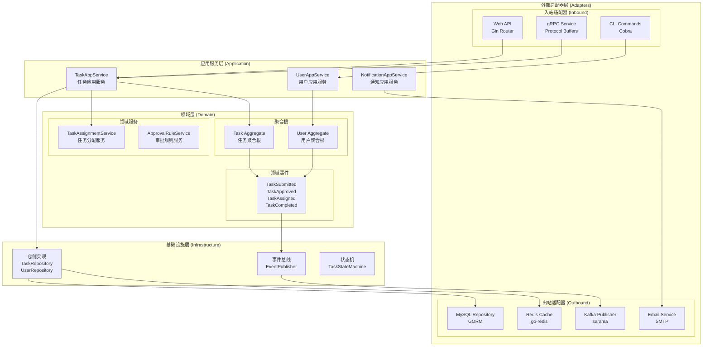
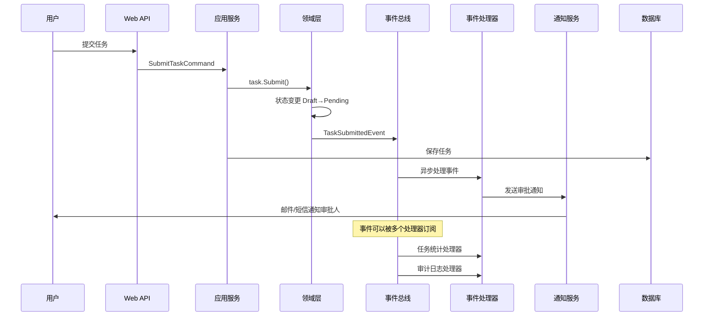

# Week 1: 任务审批流架构设计

## 🏗️ 六边形架构设计

### 架构概览图



### 六边形架构分层详解

#### 1. 领域层 (Domain Core)
**职责**：包含业务规则、领域逻辑和领域模型

```go
// 领域层结构
domain/
├── aggregate/          // 聚合根
│   ├── task.go
│   └── user.go
├── entity/             // 实体
│   ├── approval.go
│   └── notification.go
├── valueobject/        // 值对象
│   ├── task_status.go
│   ├── priority.go
│   └── approval_action.go
├── service/            // 领域服务
│   ├── task_assignment_service.go
│   └── approval_rule_service.go
├── event/              // 领域事件
│   ├── task_events.go
│   └── user_events.go
├── repository/         // 仓储接口
│   ├── task_repository.go
│   └── user_repository.go
└── specification/      // 业务规格
    ├── task_specification.go
    └── approval_specification.go
```

#### 2. 应用服务层 (Application Services)
**职责**：编排领域对象，处理用例逻辑

```go
// 任务应用服务
type TaskAppService struct {
    taskRepo         TaskRepository
    userRepo         UserRepository
    assignmentSvc    TaskAssignmentService
    approvalRuleSvc  ApprovalRuleService
    eventPublisher   EventPublisher
    stateMachine     TaskStateMachine
}

// 提交任务用例
func (s *TaskAppService) SubmitTask(cmd *SubmitTaskCommand) (*TaskDTO, error) {
    // 1. 获取用户
    user, err := s.userRepo.FindByID(cmd.CreatorID)
    if err != nil {
        return nil, err
    }
    
    // 2. 创建任务聚合
    task := NewTask(cmd.Title, cmd.Description, cmd.TaskType, user.ID)
    
    // 3. 确定审批人
    approvers, err := s.approvalRuleSvc.GetRequiredApprovers(task)
    if err != nil {
        return nil, err
    }
    task.SetApprover(approvers[0].ID)
    
    // 4. 提交任务
    if err := task.Submit(user); err != nil {
        return nil, err
    }
    
    // 5. 保存到仓储
    if err := s.taskRepo.Save(task); err != nil {
        return nil, err
    }
    
    // 6. 发布领域事件
    for _, event := range task.GetEvents() {
        s.eventPublisher.Publish(event)
    }
    
    return TaskToDTO(task), nil
}

// 审批任务用例
func (s *TaskAppService) ApproveTask(cmd *ApproveTaskCommand) error {
    // 1. 获取任务和审批人
    task, err := s.taskRepo.FindByID(cmd.TaskID)
    if err != nil {
        return err
    }
    
    approver, err := s.userRepo.FindByID(cmd.ApproverID)
    if err != nil {
        return err
    }
    
    // 2. 执行审批
    if err := task.Approve(approver, cmd.Comment); err != nil {
        return err
    }
    
    // 3. 保存更改
    if err := s.taskRepo.Save(task); err != nil {
        return err
    }
    
    // 4. 发布事件
    for _, event := range task.GetEvents() {
        s.eventPublisher.Publish(event)
    }
    
    return nil
}
```

#### 3. 适配器层 (Adapters)

**入站适配器 - Web API**
```go
// HTTP 控制器
type TaskController struct {
    taskAppService *TaskAppService
}

func (c *TaskController) SubmitTask(ctx *gin.Context) {
    var req SubmitTaskRequest
    if err := ctx.ShouldBindJSON(&req); err != nil {
        ctx.JSON(400, gin.H{"error": err.Error()})
        return
    }
    
    cmd := &SubmitTaskCommand{
        Title:       req.Title,
        Description: req.Description,
        TaskType:    req.TaskType,
        CreatorID:   UserID(req.CreatorID),
    }
    
    result, err := c.taskAppService.SubmitTask(cmd)
    if err != nil {
        ctx.JSON(500, gin.H{"error": err.Error()})
        return
    }
    
    ctx.JSON(200, result)
}
```

**出站适配器 - 数据库仓储**
```go
// MySQL 仓储实现
type mysqlTaskRepository struct {
    db *gorm.DB
}

func (r *mysqlTaskRepository) Save(task *Task) error {
    taskModel := r.domainToModel(task)
    return r.db.Save(taskModel).Error
}

func (r *mysqlTaskRepository) FindByID(id TaskID) (*Task, error) {
    var taskModel TaskModel
    if err := r.db.First(&taskModel, "id = ?", string(id)).Error; err != nil {
        return nil, err
    }
    return r.modelToDomain(&taskModel), nil
}
```

## 🎯 事件驱动架构设计

### 事件流架构图



### 领域事件设计

#### 事件定义
```go
// 基础事件接口
type DomainEvent interface {
    EventID() string
    EventType() string
    AggregateID() string
    OccurredAt() time.Time
    Version() int
}

// 任务提交事件
type TaskSubmittedEvent struct {
    eventID     string
    taskID      TaskID
    creatorID   UserID
    approverID  UserID
    title       string
    occurredAt  time.Time
}

func (e *TaskSubmittedEvent) EventID() string { return e.eventID }
func (e *TaskSubmittedEvent) EventType() string { return "task.submitted" }
func (e *TaskSubmittedEvent) AggregateID() string { return string(e.taskID) }
func (e *TaskSubmittedEvent) OccurredAt() time.Time { return e.occurredAt }

// 任务审批事件
type TaskApprovedEvent struct {
    eventID     string
    taskID      TaskID
    approverID  UserID
    comment     string
    occurredAt  time.Time
}

// 任务分配事件
type TaskAssignedEvent struct {
    eventID     string
    taskID      TaskID
    assigneeID  UserID
    assignerID  UserID
    occurredAt  time.Time
}

// 任务完成事件
type TaskCompletedEvent struct {
    eventID     string
    taskID      TaskID
    assigneeID  UserID
    result      string
    occurredAt  time.Time
}
```

#### 事件总线实现
```go
// 事件发布器接口
type EventPublisher interface {
    Publish(event DomainEvent) error
    PublishBatch(events []DomainEvent) error
}

// 事件处理器接口
type EventHandler interface {
    Handle(event DomainEvent) error
    CanHandle(eventType string) bool
}

// Kafka 事件总线实现
type kafkaEventBus struct {
    producer sarama.SyncProducer
    topic    string
}

func (bus *kafkaEventBus) Publish(event DomainEvent) error {
    eventData, err := json.Marshal(event)
    if err != nil {
        return err
    }
    
    message := &sarama.ProducerMessage{
        Topic: bus.topic,
        Key:   sarama.StringEncoder(event.AggregateID()),
        Value: sarama.ByteEncoder(eventData),
        Headers: []sarama.RecordHeader{
            {Key: []byte("eventType"), Value: []byte(event.EventType())},
            {Key: []byte("eventID"), Value: []byte(event.EventID())},
        },
    }
    
    _, _, err = bus.producer.SendMessage(message)
    return err
}
```

### 事件处理器设计

#### 通知处理器
```go
// 通知事件处理器
type NotificationEventHandler struct {
    userRepo         UserRepository
    notificationSvc  NotificationService
    emailSvc         EmailService
}

func (h *NotificationEventHandler) Handle(event DomainEvent) error {
    switch e := event.(type) {
    case *TaskSubmittedEvent:
        return h.handleTaskSubmitted(e)
    case *TaskApprovedEvent:
        return h.handleTaskApproved(e)
    case *TaskAssignedEvent:
        return h.handleTaskAssigned(e)
    default:
        return nil
    }
}

func (h *NotificationEventHandler) handleTaskSubmitted(event *TaskSubmittedEvent) error {
    // 1. 获取审批人信息
    approver, err := h.userRepo.FindByID(event.approverID)
    if err != nil {
        return err
    }
    
    // 2. 发送邮件通知
    notification := &EmailNotification{
        To:      approver.Email,
        Subject: fmt.Sprintf("新任务待审批: %s", event.title),
        Body:    h.buildApprovalEmailBody(event),
    }
    
    return h.emailSvc.Send(notification)
}
```

#### 统计处理器
```go
// 任务统计事件处理器
type TaskStatsEventHandler struct {
    statsRepo TaskStatsRepository
    cache     Cache
}

func (h *TaskStatsEventHandler) Handle(event DomainEvent) error {
    switch event.EventType() {
    case "task.submitted":
        return h.incrementCounter("tasks.submitted")
    case "task.approved":
        return h.incrementCounter("tasks.approved")
    case "task.completed":
        return h.incrementCounter("tasks.completed")
    }
    return nil
}

func (h *TaskStatsEventHandler) incrementCounter(key string) error {
    // 更新 Redis 计数器
    return h.cache.Increment(key, 1)
}
```

#### 审计日志处理器
```go
// 审计日志事件处理器
type AuditLogEventHandler struct {
    auditRepo AuditLogRepository
}

func (h *AuditLogEventHandler) Handle(event DomainEvent) error {
    auditLog := &AuditLog{
        EventID:     event.EventID(),
        EventType:   event.EventType(),
        AggregateID: event.AggregateID(),
        EventData:   h.serializeEvent(event),
        OccurredAt:  event.OccurredAt(),
    }
    
    return h.auditRepo.Save(auditLog)
}
```

## 🔧 依赖注入架构

### Wire 依赖注入配置
```go
//go:build wireinject
// +build wireinject

package main

import (
    "github.com/google/wire"
    "gorm.io/gorm"
)

// 提供者集合
var infrastructureSet = wire.NewSet(
    // 数据库
    NewDatabase,
    
    // 仓储
    NewTaskRepository,
    NewUserRepository,
    
    // 事件总线
    NewEventPublisher,
    NewEventBus,
    
    // 缓存
    NewRedisClient,
    NewCache,
)

var domainSet = wire.NewSet(
    // 领域服务
    NewTaskAssignmentService,
    NewApprovalRuleService,
    
    // 状态机
    NewTaskStateMachine,
)

var applicationSet = wire.NewSet(
    // 应用服务
    NewTaskAppService,
    NewUserAppService,
    NewNotificationAppService,
)

var handlerSet = wire.NewSet(
    // 事件处理器
    NewNotificationEventHandler,
    NewTaskStatsEventHandler,
    NewAuditLogEventHandler,
)

// 应用程序装配
func InitializeApp() (*App, error) {
    wire.Build(
        infrastructureSet,
        domainSet,
        applicationSet,
        handlerSet,
        NewApp,
    )
    return nil, nil
}
```

## 📊 架构质量属性

### 1. 可维护性
- **分层清晰**：每层职责明确，依赖方向单一
- **松耦合**：通过接口和事件解耦各个组件
- **高内聚**：相关功能聚集在同一模块内

### 2. 可扩展性
- **新增适配器**：可以轻松添加新的输入/输出适配器
- **新增事件处理器**：事件驱动支持无侵入式功能扩展
- **新增领域服务**：领域层支持业务逻辑扩展

### 3. 可测试性
- **接口隔离**：每层都通过接口交互，便于 Mock
- **依赖注入**：可以注入测试桩
- **事件机制**：可以验证事件发布和处理

### 4. 性能优化
- **缓存层**：Redis 缓存热点数据
- **异步处理**：事件驱动支持异步处理
- **数据库优化**：仓储模式支持查询优化

## 🧪 架构验证清单

### 设计原则验证
- [x] **单一职责原则**：每个类/模块职责单一
- [x] **开闭原则**：对扩展开放，对修改关闭
- [x] **依赖倒置原则**：高层模块不依赖低层模块
- [x] **接口隔离原则**：客户端不依赖不需要的接口

### DDD 模式验证
- [x] **聚合根**：Task 和 User 作为一致性边界
- [x] **领域服务**：复杂业务逻辑封装在领域服务中
- [x] **仓储模式**：数据访问抽象为仓储接口
- [x] **领域事件**：业务事件驱动系统集成

### 六边形架构验证
- [x] **端口和适配器**：清晰的输入输出适配器
- [x] **业务逻辑隔离**：核心业务逻辑不依赖外部技术
- [x] **可替换性**：外部依赖可以轻松替换

## 📈 架构演进路径

### Phase 1: 单体架构（当前）
- 所有模块在同一个进程中
- 使用内存事件总线
- 单一数据库

### Phase 2: 模块化单体
- 按限界上下文拆分模块
- 引入消息队列（Kafka）
- 数据库按模块分离

### Phase 3: 微服务架构
- 任务服务、用户服务、通知服务独立部署
- 服务间通过事件和 API 通信
- 分布式数据管理

这个架构设计为任务审批流提供了：
1. **清晰的分层结构**
2. **灵活的事件驱动机制**  
3. **良好的扩展性和可测试性**
4. **面向未来的演进能力**
