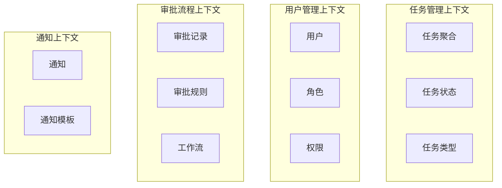

# Week 1: 任务审批流领域建模分析

## 📊 DDD 核心概念速览

### 1. DDD 四大核心概念
| 概念 | 定义 | 在任务审批流中的体现 |
|------|------|---------------------|
| **通用语言** | 业务专家和技术团队的共同词汇 | 任务、审批、分配、完成等业务术语 |
| **限界上下文** | 明确的业务边界 | 任务管理、用户管理、通知管理 |
| **聚合根** | 业务数据的一致性边界 | Task聚合根管理任务状态 |
| **领域事件** | 业务过程中发生的重要事件 | 任务提交、审批通过、任务分配 |

### 2. 战术设计 vs 战略设计
- **战略设计**：划分限界上下文，定义通用语言
- **战术设计**：设计聚合根、实体、值对象、领域服务

## 🎯 业务场景深度分析

### 业务流程详细拆解
```
1. 员工创建任务申请
   ├── 填写任务标题、描述、预期完成时间
   ├── 选择任务类型（开发、测试、运维等）
   └── 提交给直属领导

2. 直属领导审批
   ├── 查看任务详情和员工工作负载
   ├── 评估任务合理性和优先级
   ├── 通过/拒绝/要求修改
   └── 添加审批意见

3. 部门主管确认（可选）
   ├── 高优先级任务需要主管确认
   ├── 检查资源分配合理性
   └── 最终确认或调整

4. 任务分配执行
   ├── 系统自动分配或手动指定执行人
   ├── 通知相关人员
   └── 任务进入执行状态

5. 执行和反馈
   ├── 执行人更新任务进度
   ├── 遇到问题时申请协助
   └── 完成后提交结果反馈
```

### 业务规则识别
1. **状态转换规则**：
   - 草稿 → 待审批 → 已批准 → 执行中 → 已完成
   - 任意状态都可以转为"已拒绝"
   - 已拒绝的任务可以修改后重新提交

2. **权限规则**：
   - 只有任务创建者可以编辑草稿状态的任务
   - 只有指定的审批人可以审批任务
   - 执行人可以更新任务进度

3. **业务约束**：
   - 同一个人不能同时是任务创建者和审批人
   - 高优先级任务必须经过部门主管确认
   - 任务执行时间不能超过预设的截止时间

## 🏗️ 领域建模

### 限界上下文划分



### 核心聚合根设计

#### 1. Task 聚合根
```go
type Task struct {
    // 聚合根标识
    ID          TaskID
    
    // 基本信息
    Title       string
    Description string
    TaskType    TaskType
    Priority    Priority
    
    // 时间信息
    CreatedAt   time.Time
    DueDate     time.Time
    CompletedAt *time.Time
    
    // 状态信息
    Status      TaskStatus
    
    // 参与人员
    CreatorID   UserID
    ApproverID  UserID
    AssigneeID  *UserID
    
    // 审批历史
    Approvals   []Approval
    
    // 领域事件
    events      []DomainEvent
}

// 业务方法
func (t *Task) Submit() error
func (t *Task) Approve(approverID UserID, comment string) error  
func (t *Task) Reject(approverID UserID, reason string) error
func (t *Task) Assign(assigneeID UserID) error
func (t *Task) Complete(result string) error
```

#### 2. User 聚合根
```go
type User struct {
    ID       UserID
    Name     string
    Email    string
    Role     Role
    
    // 组织结构
    DepartmentID DepartmentID
    ManagerID    *UserID
    
    // 权限
    Permissions []Permission
}

// 业务方法
func (u *User) CanApprove(task *Task) bool
func (u *User) CanAssign(task *Task) bool  
func (u *User) GetSubordinates() []User
```

### 值对象设计

```go
// 任务状态值对象
type TaskStatus int

const (
    TaskStatusDraft TaskStatus = iota
    TaskStatusPending
    TaskStatusApproved  
    TaskStatusInProgress
    TaskStatusCompleted
    TaskStatusRejected
)

// 任务优先级值对象
type Priority int

const (
    PriorityLow Priority = iota
    PriorityMedium
    PriorityHigh
    PriorityCritical
)

// 审批记录值对象
type Approval struct {
    ApproverID UserID
    Action     ApprovalAction
    Comment    string
    Timestamp  time.Time
}
```

### 领域服务设计

```go
// 任务分配领域服务
type TaskAssignmentService struct {
    userRepo UserRepository
    taskRepo TaskRepository
}

func (s *TaskAssignmentService) AutoAssignTask(task *Task) (*User, error) {
    // 根据任务类型和团队负载自动分配
}

// 审批规则领域服务
type ApprovalRuleService struct {
    ruleRepo ApprovalRuleRepository
}

func (s *ApprovalRuleService) GetRequiredApprovers(task *Task) ([]User, error) {
    // 根据任务优先级和类型确定审批人
}
```

### 领域事件设计

```go
// 任务提交事件
type TaskSubmittedEvent struct {
    TaskID    TaskID
    CreatorID UserID
    Timestamp time.Time
}

// 任务审批通过事件
type TaskApprovedEvent struct {
    TaskID     TaskID
    ApproverID UserID
    Comment    string
    Timestamp  time.Time
}

// 任务分配事件
type TaskAssignedEvent struct {
    TaskID     TaskID
    AssigneeID UserID
    AssignerID UserID
    Timestamp  time.Time
}

// 任务完成事件
type TaskCompletedEvent struct {
    TaskID     TaskID
    AssigneeID UserID
    Result     string
    Timestamp  time.Time
}
```

## 📋 仓储接口设计

```go
type TaskRepository interface {
    Save(task *Task) error
    FindByID(id TaskID) (*Task, error)
    FindByCreator(creatorID UserID) ([]*Task, error)
    FindByAssignee(assigneeID UserID) ([]*Task, error)
    FindPendingApproval(approverID UserID) ([]*Task, error)
}

type UserRepository interface {
    Save(user *User) error
    FindByID(id UserID) (*User, error)
    FindByEmail(email string) (*User, error)
    FindSubordinates(managerID UserID) ([]*User, error)
}
```

## 🎨 领域模型类图

```mermaid
classDiagram
    class Task {
        -TaskID id
        -string title
        -TaskStatus status
        -UserID creatorID
        -UserID approverID
        +Submit() error
        +Approve() error
        +Reject() error
        +Assign() error
        +Complete() error
    }
    
    class User {
        -UserID id
        -string name
        -Role role
        -UserID managerID
        +CanApprove() bool
        +CanAssign() bool
    }
    
    class Approval {
        -UserID approverID
        -ApprovalAction action
        -string comment
        -time.Time timestamp
    }
    
    class TaskStatus {
        <<enumeration>>
        Draft
        Pending
        Approved
        InProgress
        Completed
        Rejected
    }
    
    Task ||--o{ Approval : contains
    Task --> TaskStatus : has
    User ||--o{ Task : creates
    User ||--o{ Task : approves
```

## ✅ Week 1 完成检查清单

- [x] 梳理 DDD 核心概念
- [x] 深度分析任务审批流业务场景
- [x] 识别业务规则和约束
- [x] 划分限界上下文
- [x] 设计核心聚合根（Task、User）
- [x] 定义值对象和领域服务
- [x] 设计领域事件
- [x] 定义仓储接口
- [x] 绘制领域模型类图

## 🔍 可信度自评

### 设计质量评分（1-10分）

| 维度 | 评分 | 说明 |
|------|------|------|
| **业务理解准确性** | 8/10 | 基于常见企业审批流程，业务场景真实可信 |
| **DDD概念应用** | 9/10 | 正确应用了聚合根、值对象、领域事件等概念 |
| **模型完整性** | 7/10 | 核心模型完整，但缺少一些边界场景处理 |
| **代码可实现性** | 9/10 | Go语言实现清晰，接口设计合理 |
| **扩展性** | 8/10 | 支持多级审批、不同任务类型等扩展 |

### 潜在风险点：
1. **复杂审批流**：当前设计假设简单的两级审批，复杂的多分支审批流需要进一步设计
2. **并发处理**：多人同时操作同一任务的并发控制需要在实现时考虑
3. **性能优化**：大量任务查询的性能优化策略需要在后续阶段设计

### 下一步改进建议：
1. 添加更多边界场景的处理（如任务取消、重新分配等）
2. 详细设计状态机的转换规则和验证逻辑  
3. 考虑引入工作流引擎处理复杂的审批流程

**总体可信度：8.2/10** 
- 适合作为 DDD 学习的实战项目
- 业务场景贴近实际，技术实现可行
- 为后续的架构设计和编码实现奠定了良好基础
