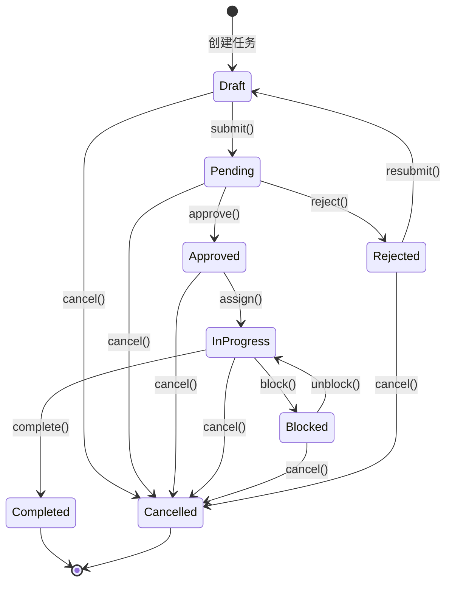

# 任务审批流状态机设计

## 🔄 状态转换图



## 📋 状态定义和规则

### 状态枚举
```go
type TaskStatus int

const (
    TaskStatusDraft TaskStatus = iota      // 草稿
    TaskStatusPending                      // 待审批  
    TaskStatusApproved                     // 已批准
    TaskStatusInProgress                   // 执行中
    TaskStatusCompleted                    // 已完成
    TaskStatusRejected                     // 已拒绝
    TaskStatusBlocked                      // 阻塞
    TaskStatusCancelled                    // 已取消
)
```

### 状态转换规则表

| 当前状态 | 允许转换到 | 触发条件 | 权限要求 |
|----------|------------|----------|----------|
| Draft | Pending | 任务信息完整 | 创建者 |
| Draft | Cancelled | 任意时间 | 创建者 |
| Pending | Approved | 审批通过 | 审批人 |
| Pending | Rejected | 审批拒绝 | 审批人 |
| Pending | Cancelled | 撤销申请 | 创建者 |
| Approved | InProgress | 分配执行人 | 管理者 |
| Approved | Cancelled | 取消任务 | 创建者/管理者 |
| InProgress | Completed | 任务完成 | 执行人 |
| InProgress | Blocked | 遇到阻碍 | 执行人 |
| InProgress | Cancelled | 取消执行 | 管理者 |
| Blocked | InProgress | 解除阻塞 | 执行人/管理者 |
| Blocked | Cancelled | 无法继续 | 管理者 |
| Rejected | Draft | 重新编辑 | 创建者 |
| Rejected | Cancelled | 放弃任务 | 创建者 |

## 🛡️ 状态机实现

```go
// 状态机接口
type TaskStateMachine interface {
    CanTransition(from, to TaskStatus) bool
    ValidateTransition(task *Task, to TaskStatus, actor *User) error
    Transition(task *Task, to TaskStatus, actor *User) error
}

// 状态机实现
type taskStateMachine struct {
    transitions map[TaskStatus][]TaskStatus
}

func NewTaskStateMachine() TaskStateMachine {
    transitions := map[TaskStatus][]TaskStatus{
        TaskStatusDraft: {
            TaskStatusPending,
            TaskStatusCancelled,
        },
        TaskStatusPending: {
            TaskStatusApproved,
            TaskStatusRejected,
            TaskStatusCancelled,
        },
        TaskStatusApproved: {
            TaskStatusInProgress,
            TaskStatusCancelled,
        },
        TaskStatusInProgress: {
            TaskStatusCompleted,
            TaskStatusBlocked,
            TaskStatusCancelled,
        },
        TaskStatusBlocked: {
            TaskStatusInProgress,
            TaskStatusCancelled,
        },
        TaskStatusRejected: {
            TaskStatusDraft,
            TaskStatusCancelled,
        },
    }
    
    return &taskStateMachine{
        transitions: transitions,
    }
}

func (sm *taskStateMachine) CanTransition(from, to TaskStatus) bool {
    allowedStates, exists := sm.transitions[from]
    if !exists {
        return false
    }
    
    for _, allowedState := range allowedStates {
        if allowedState == to {
            return true
        }
    }
    return false
}

func (sm *taskStateMachine) ValidateTransition(task *Task, to TaskStatus, actor *User) error {
    // 1. 检查状态转换是否合法
    if !sm.CanTransition(task.Status, to) {
        return fmt.Errorf("invalid transition from %v to %v", task.Status, to)
    }
    
    // 2. 检查权限
    switch to {
    case TaskStatusPending:
        if task.CreatorID != actor.ID {
            return errors.New("only creator can submit task")
        }
    case TaskStatusApproved, TaskStatusRejected:
        if task.ApproverID != actor.ID {
            return errors.New("only assigned approver can approve/reject task")
        }
    case TaskStatusInProgress:
        if !actor.CanAssign(task) {
            return errors.New("insufficient permission to assign task")
        }
    case TaskStatusCompleted:
        if task.AssigneeID == nil || *task.AssigneeID != actor.ID {
            return errors.New("only assignee can complete task")
        }
    case TaskStatusBlocked:
        if task.AssigneeID == nil || *task.AssigneeID != actor.ID {
            return errors.New("only assignee can block task")
        }
    }
    
    // 3. 检查业务规则
    switch to {
    case TaskStatusPending:
        if task.Title == "" || task.Description == "" {
            return errors.New("task title and description are required")
        }
    case TaskStatusInProgress:
        if task.AssigneeID == nil {
            return errors.New("assignee is required for in-progress task")
        }
    }
    
    return nil
}

func (sm *taskStateMachine) Transition(task *Task, to TaskStatus, actor *User) error {
    if err := sm.ValidateTransition(task, to, actor); err != nil {
        return err
    }
    
    oldStatus := task.Status
    task.Status = to
    task.UpdatedAt = time.Now()
    
    // 发布状态转换事件
    event := &TaskStatusChangedEvent{
        TaskID:    task.ID,
        OldStatus: oldStatus,
        NewStatus: to,
        ActorID:   actor.ID,
        Timestamp: time.Now(),
    }
    
    task.AddEvent(event)
    return nil
}
```

## 🎯 业务方法集成状态机

```go
// Task 聚合根中集成状态机
type Task struct {
    // ... 其他字段
    stateMachine TaskStateMachine
}

func (t *Task) Submit(actor *User) error {
    return t.stateMachine.Transition(t, TaskStatusPending, actor)
}

func (t *Task) Approve(approver *User, comment string) error {
    if err := t.stateMachine.Transition(t, TaskStatusApproved, approver); err != nil {
        return err
    }
    
    // 添加审批记录
    approval := Approval{
        ApproverID: approver.ID,
        Action:     ApprovalActionApprove,
        Comment:    comment,
        Timestamp:  time.Now(),
    }
    t.Approvals = append(t.Approvals, approval)
    
    // 发布审批事件
    t.AddEvent(&TaskApprovedEvent{
        TaskID:     t.ID,
        ApproverID: approver.ID,
        Comment:    comment,
        Timestamp:  time.Now(),
    })
    
    return nil
}

func (t *Task) Reject(approver *User, reason string) error {
    if err := t.stateMachine.Transition(t, TaskStatusRejected, approver); err != nil {
        return err
    }
    
    // 添加拒绝记录
    approval := Approval{
        ApproverID: approver.ID,
        Action:     ApprovalActionReject,
        Comment:    reason,
        Timestamp:  time.Now(),
    }
    t.Approvals = append(t.Approvals, approval)
    
    return nil
}

func (t *Task) Assign(assignee *User, assigner *User) error {
    if err := t.stateMachine.Transition(t, TaskStatusInProgress, assigner); err != nil {
        return err
    }
    
    t.AssigneeID = &assignee.ID
    
    // 发布分配事件
    t.AddEvent(&TaskAssignedEvent{
        TaskID:     t.ID,
        AssigneeID: assignee.ID,
        AssignerID: assigner.ID,
        Timestamp:  time.Now(),
    })
    
    return nil
}

func (t *Task) Complete(assignee *User, result string) error {
    if err := t.stateMachine.Transition(t, TaskStatusCompleted, assignee); err != nil {
        return err
    }
    
    now := time.Now()
    t.CompletedAt = &now
    t.Result = result
    
    // 发布完成事件
    t.AddEvent(&TaskCompletedEvent{
        TaskID:     t.ID,
        AssigneeID: assignee.ID,
        Result:     result,
        Timestamp:  now,
    })
    
    return nil
}
```

## 📊 状态统计和报表

```go
// 任务状态统计
type TaskStatusStats struct {
    Draft      int `json:"draft"`
    Pending    int `json:"pending"`
    Approved   int `json:"approved"`
    InProgress int `json:"in_progress"`
    Completed  int `json:"completed"`
    Rejected   int `json:"rejected"`
    Blocked    int `json:"blocked"`
    Cancelled  int `json:"cancelled"`
    Total      int `json:"total"`
}

// 状态统计服务
type TaskStatsService struct {
    taskRepo TaskRepository
}

func (s *TaskStatsService) GetUserTaskStats(userID UserID) (*TaskStatusStats, error) {
    tasks, err := s.taskRepo.FindByCreator(userID)
    if err != nil {
        return nil, err
    }
    
    stats := &TaskStatusStats{}
    for _, task := range tasks {
        switch task.Status {
        case TaskStatusDraft:
            stats.Draft++
        case TaskStatusPending:
            stats.Pending++
        case TaskStatusApproved:
            stats.Approved++
        case TaskStatusInProgress:
            stats.InProgress++
        case TaskStatusCompleted:
            stats.Completed++
        case TaskStatusRejected:
            stats.Rejected++
        case TaskStatusBlocked:
            stats.Blocked++
        case TaskStatusCancelled:
            stats.Cancelled++
        }
        stats.Total++
    }
    
    return stats, nil
}
```

## 🧪 状态机测试用例

```go
func TestTaskStateMachine(t *testing.T) {
    sm := NewTaskStateMachine()
    
    // 测试正常流程
    assert.True(t, sm.CanTransition(TaskStatusDraft, TaskStatusPending))
    assert.True(t, sm.CanTransition(TaskStatusPending, TaskStatusApproved))
    assert.True(t, sm.CanTransition(TaskStatusApproved, TaskStatusInProgress))
    assert.True(t, sm.CanTransition(TaskStatusInProgress, TaskStatusCompleted))
    
    // 测试非法转换
    assert.False(t, sm.CanTransition(TaskStatusDraft, TaskStatusApproved))
    assert.False(t, sm.CanTransition(TaskStatusCompleted, TaskStatusPending))
    
    // 测试权限验证
    task := &Task{
        Status:     TaskStatusPending,
        CreatorID:  UserID("creator"),
        ApproverID: UserID("approver"),
    }
    
    wrongUser := &User{ID: UserID("wrong")}
    approver := &User{ID: UserID("approver")}
    
    // 非审批人不能审批
    err := sm.ValidateTransition(task, TaskStatusApproved, wrongUser)
    assert.Error(t, err)
    
    // 审批人可以审批
    err = sm.ValidateTransition(task, TaskStatusApproved, approver)
    assert.NoError(t, err)
}
```

这个状态机设计确保了：
1. **状态转换的合法性**：只允许预定义的状态转换
2. **权限控制**：不同操作需要对应的权限
3. **业务规则验证**：转换前检查业务约束
4. **事件发布**：状态变更时发布相应事件
5. **可测试性**：清晰的接口便于单元测试
