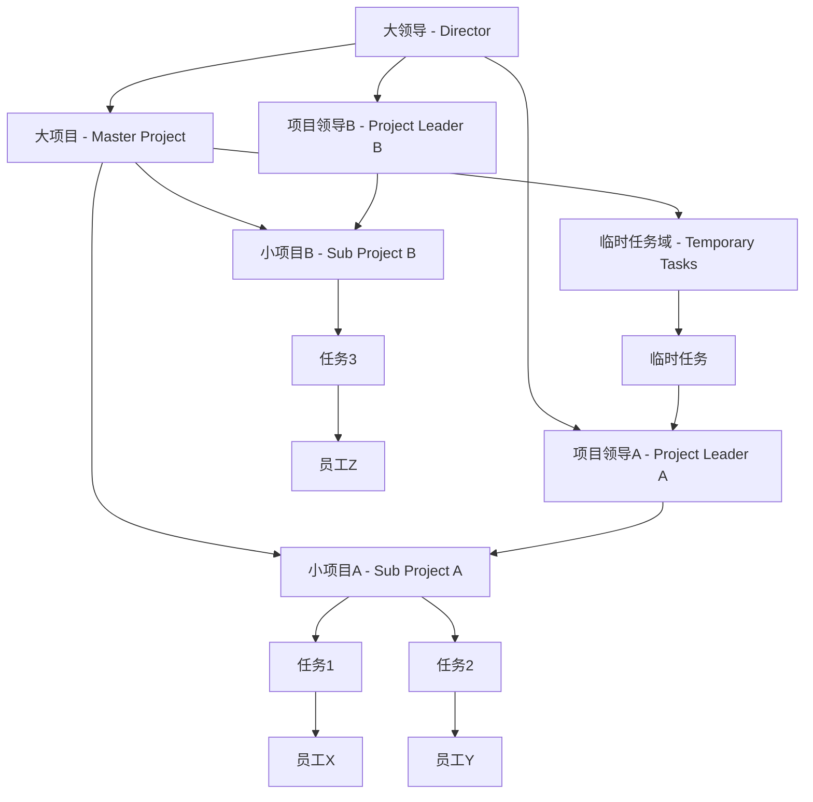
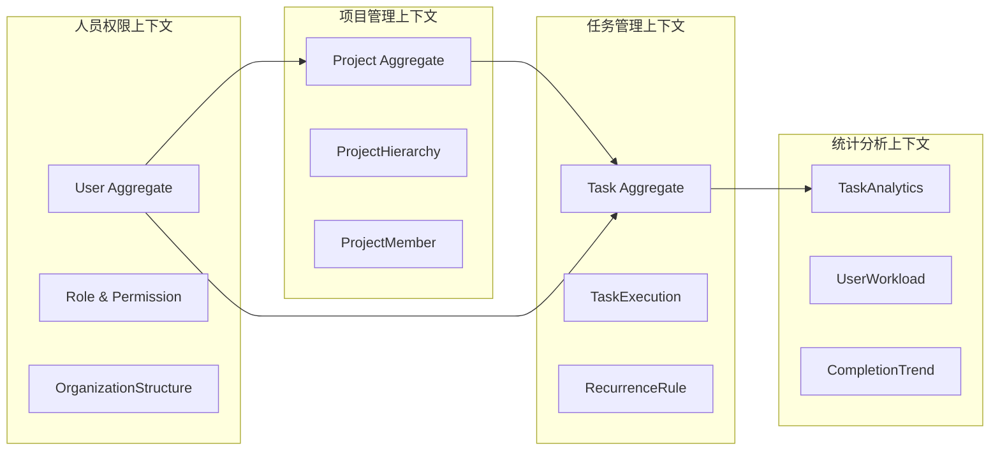
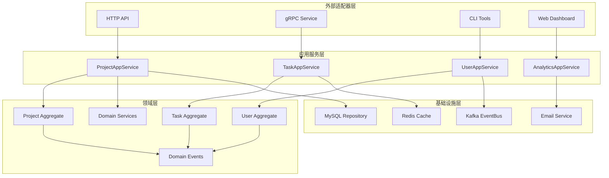
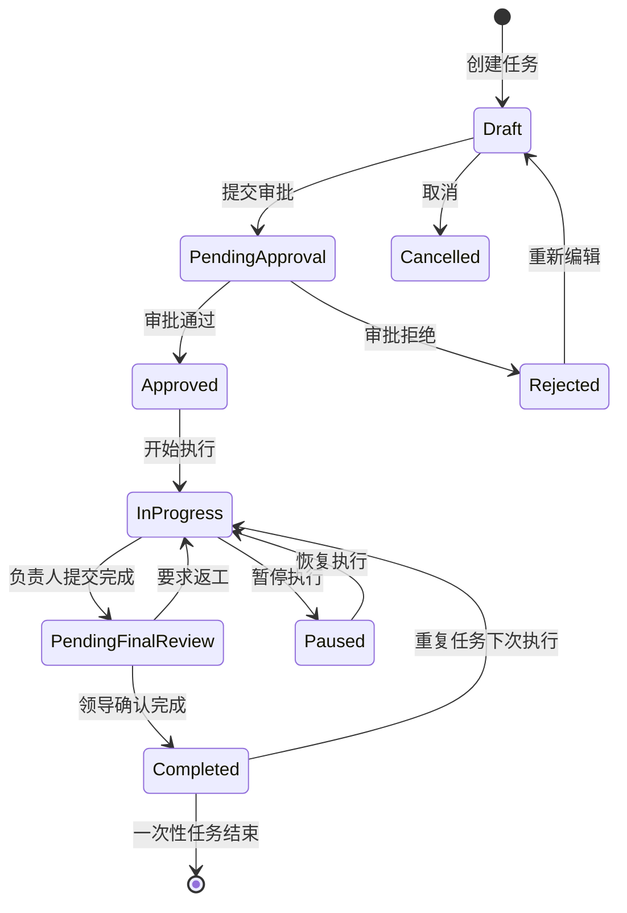
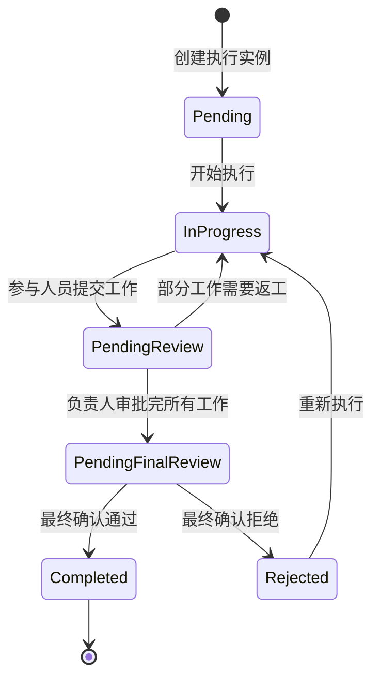
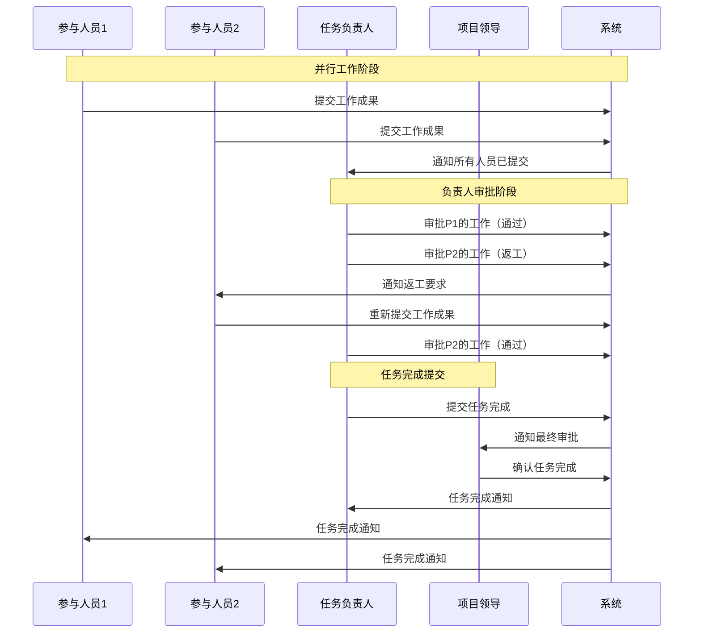
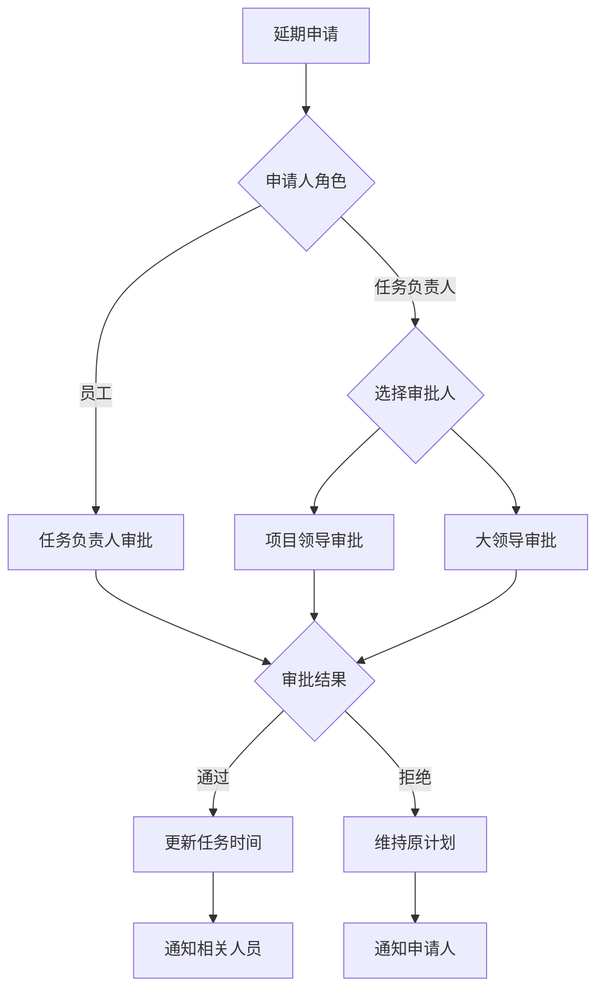

# 团队分享：多层级项目管理系统架构设计

## 📋 分享大纲

### 🎯 分享目标
- 让每位团队成员深入理解DDD架构设计思路
- 展示从业务分析到技术实现的完整过程
- 分享复杂业务建模的最佳实践
- 讨论架构设计的决策过程和权衡考量

### 👥 目标听众
- 后端开发工程师
- 架构师
- 产品经理
- 技术负责人

### ⏱️ 分享时长
预计 45-60 分钟（包含Q&A）

---

## 🚀 第一部分：项目背景和挑战（5分钟）

### 💡 为什么选择这个项目？

> **"从简单的任务审批流开始，逐步演化为企业级项目管理系统"**

#### 业务演进过程
```
简单任务审批 → 多业务流程 → 多层级项目管理 → 企业级系统
     ↓              ↓               ↓              ↓
  员工申请任务    领导分配任务     项目层级管理     完整权限体系
```

#### 核心挑战
1. **业务复杂性**：多种角色、多层级权限、复杂流程
2. **技术挑战**：如何用DDD建模复杂业务关系
3. **扩展性**：如何设计可持续演进的架构
4. **实用性**：如何平衡理论学习和实际应用

### 🎯 学习目标
- **理论内化**：通过实战项目深度理解DDD核心概念
- **架构思维**：培养复杂系统的架构设计能力
- **团队协作**：建立统一的设计语言和方法论

---

## 🏗️ 第二部分：业务域分析和建模（10分钟）

### 📊 业务场景深度剖析

#### 组织结构现实


#### 权限矩阵设计
| 角色 | 人员管理 | 项目管理 | 任务创建 | 任务分配 | 任务审批 | 任务执行 |
|------|----------|----------|----------|----------|----------|----------|
| **大领导** | ✅ 全员 | ✅ 创建/分配项目 | ✅ 临时任务 | ✅ 任意任务 | ✅ 最终确认 | ❌ |
| **项目领导** | ❌ | ✅ 项目内管理 | ✅ 项目内任务 | ✅ 项目内分配 | ✅ 项目内审批 | ✅ 可执行任务 |
| **任务负责人** | ❌ | ❌ | ❌ | ✅ 任务内人员 | ✅ 任务内工作 | ✅ 执行任务 |
| **员工** | ❌ | ❌ | ✅ 申请任务 | ❌ | ❌ | ✅ 执行任务 |

### 🎯 DDD战略设计

#### 限界上下文识别


### 💡 关键设计决策

#### 1. 为什么选择这样的聚合根划分？
- **Project聚合根**：管理项目层级关系和成员
- **Task聚合根**：管理任务执行和状态
- **User聚合根**：管理用户角色和权限

#### 2. 如何处理跨聚合根的业务规则？
- 通过**领域服务**协调多个聚合根
- 使用**领域事件**实现最终一致性
- **应用服务**编排复杂用例

---

## 🎨 第三部分：核心领域模型设计（15分钟）

### 🏛️ Task聚合根深度解析

#### 聚合根结构设计
```go
type Task struct {
    // 身份标识
    ID              TaskID
    Title           string
    Description     string
    
    // 业务属性
    TaskType        TaskType        // 一次性 vs 重复任务
    Priority        Priority        // 紧急 vs 日常
    ProjectID       ProjectID       // 项目归属
    
    // 人员角色 - 核心设计点
    CreatorID       UserID          // 创建者
    ResponsibleID   UserID          // 负责人（关键角色）
    ParticipantIDs  []UserID        // 参与人员（动态管理）
    
    // 执行管理
    Executions      []TaskExecution // 支持重复执行
    
    // 时间管理
    StartDate       time.Time
    DueDate         time.Time
    ExtensionRequests []ExtensionRequest // 延期申请
    
    // 状态管理
    Status          TaskStatus
    events          []DomainEvent
}
```

#### 核心业务方法解析

**1. 动态团队管理**
```go
// 任务负责人添加参与人员
func (t *Task) AddParticipant(responsible *User, participant *User) error {
    // 权限检查：只有任务负责人可以管理团队
    if t.ResponsibleID != responsible.ID {
        return errors.New("only task responsible can add participants")
    }
    
    // 业务规则：参与人员必须是项目成员
    // 通过领域服务验证项目成员身份
    
    t.ParticipantIDs = append(t.ParticipantIDs, participant.ID)
    
    // 发布领域事件
    t.AddEvent(&ParticipantAddedEvent{...})
    
    return nil
}
```

**2. 多人协作完成机制**
```go
// 参与人员提交工作成果
func (t *Task) SubmitWork(participant *User, executionID ExecutionID, workResult string) error
// 任务负责人审批工作成果
func (t *Task) ReviewParticipantWork(responsible *User, ..., approved bool) error
// 负责人提交任务完成
func (t *Task) SubmitTaskCompletion(responsible *User, ...) error
// 项目领导确认最终完成
func (t *Task) ConfirmTaskCompletion(reviewer *User, ..., approved bool) error
```

**3. 重复任务工作流**
```go
type RecurrenceRule struct {
    Frequency       RecurrenceFrequency // DAILY, WEEKLY, MONTHLY
    Interval        int                 // 每N天/周/月
    EndDate         *time.Time          // 结束条件
    MaxExecutions   *int                // 最大执行次数
}

// 准备下次执行
func (t *Task) PrepareNextExecution() {
    nextExecution := TaskExecution{
        ExecutionID:   NewExecutionID(),
        ExecutionDate: t.calculateNextExecutionDate(),
        Status:        ExecutionStatusPending,
        Participants:  t.ParticipantIDs, // 继承参与人员
    }
    t.Executions = append(t.Executions, nextExecution)
}
```

### 🔐 权限控制设计

#### 权限服务架构
```go
type TaskPermissionService struct {
    userRepo    UserRepository
    projectRepo ProjectRepository
    taskRepo    TaskRepository
}

// 核心权限检查逻辑
func (s *TaskPermissionService) CanUserPerformAction(
    userID UserID,
    action string,
    resourceType string,
    resourceID string,
    context map[string]interface{},
) (bool, error) {
    // RBAC (基于角色) + ABAC (基于属性) 混合模型
}
```

#### 延期申请权限设计
```go
// 延期申请的复杂权限逻辑
func (s *TaskPermissionService) CanReviewExtensionRequest(
    reviewerID UserID,
    requesterID UserID,
    taskID TaskID,
) (bool, error) {
    // 员工申请延期 → 任务负责人审批
    if task.ResponsibleID == reviewerID {
        return true, nil
    }
    
    // 任务负责人申请延期 → 项目领导或大领导审批
    if requesterID == task.ResponsibleID {
        if project.ManagerID != nil && *project.ManagerID == reviewerID {
            return true, nil
        }
        if project.OwnerID == reviewerID {
            return true, nil
        }
    }
    
    return false, nil
}
```

---

## 🏗️ 第四部分：架构设计和技术实现（10分钟）

### 🎯 六边形架构实现

#### 整体架构图


### 🔄 事件驱动架构

#### 核心领域事件
```go
// 任务生命周期事件
type TaskSubmittedEvent struct {
    TaskID      TaskID
    CreatorID   UserID
    ProjectID   ProjectID
    Timestamp   time.Time
}

type ParticipantAddedEvent struct {
    TaskID        TaskID
    ParticipantID UserID
    ResponsibleID UserID
    Timestamp     time.Time
}

type TaskCompletedEvent struct {
    TaskID       TaskID
    ExecutionID  ExecutionID
    ResponsibleID UserID
    Timestamp    time.Time
}
```

#### 事件处理器设计
```go
// 通知处理器
type NotificationEventHandler struct {
    emailService EmailService
    userRepo     UserRepository
}

func (h *NotificationEventHandler) Handle(event DomainEvent) error {
    switch e := event.(type) {
    case *TaskSubmittedEvent:
        return h.notifyApprover(e)
    case *ParticipantAddedEvent:
        return h.notifyParticipant(e)
    case *TaskCompletedEvent:
        return h.notifyStakeholders(e)
    }
}

// 统计分析处理器
type AnalyticsEventHandler struct {
    analyticsService TaskAnalyticsService
    cache           Cache
}

func (h *AnalyticsEventHandler) Handle(event DomainEvent) error {
    // 实时更新统计数据
    // 清除相关缓存
    // 触发报表生成
}
```

### 📊 统计分析系统

#### 核心统计指标
```go
type TaskStatistics struct {
    // 基础统计
    TotalTasks         int     `json:"total_tasks"`
    CompletedTasks     int     `json:"completed_tasks"`
    CompletionRate     float64 `json:"completion_rate"`
    
    // 时效统计
    OverdueTasks       int     `json:"overdue_tasks"`
    ExtensionRate      float64 `json:"extension_rate"`
    AverageCompletionTime float64 `json:"avg_completion_days"`
    
    // 优先级统计
    UrgentTasks        TaskPriorityStats `json:"urgent_tasks"`
    NormalTasks        TaskPriorityStats `json:"normal_tasks"`
    
    // 趋势分析
    CompletionTrend    []CompletionTrendData `json:"completion_trend"`
}
```

#### 性能优化策略
```go
// 缓存策略
func (s *TaskAnalyticsService) GetProjectTaskStatistics(
    projectID ProjectID,
    startDate, endDate time.Time,
) (*TaskStatistics, error) {
    // 1. 检查缓存
    cacheKey := fmt.Sprintf("task_stats_%s_%s_%s", 
        projectID, startDate.Format("2006-01-02"), endDate.Format("2006-01-02"))
    
    if cached, err := s.cache.Get(cacheKey); err == nil {
        return deserializeStats(cached), nil
    }
    
    // 2. 计算统计数据
    stats := s.calculateStatistics(projectID, startDate, endDate)
    
    // 3. 缓存结果（1小时过期）
    s.cache.Set(cacheKey, serializeStats(stats), time.Hour)
    
    return stats, nil
}
```

---

## 🔄 第五部分：状态机和业务流程（8分钟）

### 📋 双层状态机设计

#### 任务级状态机


#### 执行级状态机


### 🔄 复杂业务流程

#### 多人协作完成流程


#### 延期申请流程


---

## 💡 第六部分：设计亮点和最佳实践（7分钟）

### 🎯 核心设计亮点

#### 1. 双重身份角色设计
```
项目领导 = 管理者 + 执行者
├── 作为管理者：管理项目内任务的CRUD
├── 作为执行者：可以被分配任务并执行
└── 权限边界：不能管理项目外的任务
```

**设计价值**：
- 贴近企业实际情况
- 避免权限设计过于僵化
- 支持灵活的组织结构

#### 2. 任务负责人机制
```
任务负责人 ≠ 项目领导
├── 动态团队管理：可以添加/移除参与人员
├── 工作成果审批：审批参与人员的工作
└── 任务完成提交：代表团队提交最终成果
```

**设计价值**：
- 明确任务执行责任
- 支持跨职能团队协作
- 减少管理层级和审批环节

#### 3. 重复任务工作流
```
创建一次 → 多次执行 → 独立归档
├── WorkflowTemplate：定义重复规则
├── TaskExecution：每次执行的独立记录
└── 自动调度：系统自动准备下次执行
```

**设计价值**：
- 减少重复创建工作量
- 保持历史执行记录
- 支持灵活的重复规则

### 🏗️ DDD最佳实践应用

#### 1. 聚合根边界设计
```go
// Task聚合根：管理任务执行的完整生命周期
type Task struct {
    // 聚合根内部保持强一致性
    Executions []TaskExecution          // 执行记录
    ParticipantCompletions []Completion // 完成记录
    ExtensionRequests []ExtensionRequest // 延期申请
    
    // 通过ID引用其他聚合根
    ProjectID ProjectID    // 项目引用
    ResponsibleID UserID   // 用户引用
}

// 边界原则：
// ✅ 一个事务只能修改一个聚合根
// ✅ 聚合根之间通过ID引用
// ✅ 复杂操作通过领域服务协调
```

#### 2. 领域事件驱动
```go
// 事件发布：在聚合根内部发布
func (t *Task) AddParticipant(responsible *User, participant *User) error {
    // 业务逻辑执行
    t.ParticipantIDs = append(t.ParticipantIDs, participant.ID)
    
    // 发布领域事件
    t.AddEvent(&ParticipantAddedEvent{
        TaskID:        t.ID,
        ParticipantID: participant.ID,
        ResponsibleID: responsible.ID,
        Timestamp:     time.Now(),
    })
    
    return nil
}

// 事件处理：异步处理副作用
type NotificationEventHandler struct{}
func (h *NotificationEventHandler) Handle(event *ParticipantAddedEvent) error {
    // 发送邮件通知
    // 更新统计数据
    // 记录操作日志
}
```

#### 3. 应用服务编排
```go
// 应用服务：编排多个聚合根的操作
func (s *TaskAppService) AssignTaskToUser(cmd *AssignTaskCommand) error {
    // 1. 获取相关聚合根
    task, _ := s.taskRepo.FindByID(cmd.TaskID)
    project, _ := s.projectRepo.FindByID(task.ProjectID)
    user, _ := s.userRepo.FindByID(cmd.UserID)
    
    // 2. 通过领域服务检查权限
    canAssign, _ := s.permissionService.CanAssignTask(cmd.AssignerID, task.ID)
    if !canAssign {
        return errors.New("insufficient permission")
    }
    
    // 3. 执行业务操作
    task.AssignToUser(user)
    
    // 4. 保存聚合根
    s.taskRepo.Save(task)
    
    // 5. 发布事件
    for _, event := range task.GetEvents() {
        s.eventPublisher.Publish(event)
    }
    
    return nil
}
```

### 📊 性能和扩展性考虑

#### 1. 缓存策略
```go
// 多级缓存设计
type TaskAnalyticsService struct {
    // L1: 内存缓存（热点数据）
    memoryCache *sync.Map
    
    // L2: Redis缓存（分布式缓存）
    redisCache Cache
    
    // L3: 数据库（持久化存储）
    taskRepo TaskRepository
}

// 缓存键设计
func (s *TaskAnalyticsService) getCacheKey(projectID ProjectID, startDate, endDate time.Time) string {
    return fmt.Sprintf("task_stats_%s_%s_%s", 
        projectID, 
        startDate.Format("2006-01-02"), 
        endDate.Format("2006-01-02"))
}
```

#### 2. 数据库优化
```sql
-- 核心查询优化
CREATE INDEX idx_task_project_status ON tasks(project_id, status);
CREATE INDEX idx_task_responsible_status ON tasks(responsible_id, status);
CREATE INDEX idx_task_due_date ON tasks(due_date) WHERE status IN ('in_progress', 'pending_final_review');

-- 分区策略（按时间分区）
CREATE TABLE task_executions (
    execution_id VARCHAR(36) PRIMARY KEY,
    task_id VARCHAR(36) NOT NULL,
    execution_date DATE NOT NULL,
    -- 其他字段
) PARTITION BY RANGE (YEAR(execution_date));
```

---

## 🤔 第七部分：设计权衡和讨论（5分钟）

### ⚖️ 关键设计决策

#### 1. 为什么选择聚合根这样划分？

**决策**：Task、Project、User 三个独立聚合根

**考虑因素**：
- ✅ **一致性边界**：任务执行状态需要强一致性
- ✅ **并发性能**：避免大聚合根锁竞争
- ✅ **业务边界**：符合业务概念模型
- ❌ **复杂性**：需要领域服务协调跨聚合操作

**替代方案**：
- 方案A：Project包含所有Task（聚合过大）
- 方案B：Task包含User信息（职责不清）

#### 2. 为什么采用双层状态机？

**决策**：任务状态机 + 执行状态机分离

**考虑因素**：
- ✅ **重复任务支持**：一个任务多次执行
- ✅ **状态清晰**：任务创建态 vs 执行态分离
- ✅ **扩展性**：支持复杂的执行流程
- ❌ **理解复杂度**：需要理解两层状态概念

**替代方案**：
- 方案A：单一状态机（无法支持重复任务）
- 方案B：每次执行创建新任务（数据冗余）

#### 3. 为什么选择事件驱动架构？

**决策**：领域事件 + 异步处理

**考虑因素**：
- ✅ **解耦**：核心业务与副作用分离
- ✅ **扩展性**：新增功能无需修改核心逻辑
- ✅ **性能**：异步处理提高响应速度
- ❌ **复杂性**：最终一致性的复杂度
- ❌ **调试难度**：分布式系统调试复杂

**替代方案**：
- 方案A：同步调用（简单但耦合度高）
- 方案B：定时任务轮询（延迟高，资源消耗大）

### 🔍 待优化的设计点

#### 1. 权限模型可以进一步抽象
```go
// 当前设计：硬编码权限检查
func (t *Task) CanAssignTask(user *User, project *Project) bool {
    if project.OwnerID == user.ID { return true }
    if project.ManagerID != nil && *project.ManagerID == user.ID { return true }
    return false
}

// 改进方案：策略模式 + 规则引擎
type PermissionRule interface {
    Evaluate(user *User, resource Resource, action string) bool
}

type TaskAssignmentRule struct{}
func (r *TaskAssignmentRule) Evaluate(user *User, task *Task, action string) bool {
    // 可配置的权限规则
}
```

#### 2. 统计分析可以引入更多维度
- 按部门统计
- 按技能标签统计  
- 任务复杂度评估
- 团队协作效率分析

#### 3. 工作流引擎集成
- 支持更复杂的审批流程
- 可视化流程设计
- 条件分支和并行处理

---

## 🎯 第八部分：总结和下一步（5分钟）

### 📊 项目价值总结

#### 1. 学习价值
- **DDD实战**：通过复杂业务场景深度理解DDD核心概念
- **架构思维**：培养系统性的架构设计能力
- **最佳实践**：掌握企业级系统设计的最佳实践

#### 2. 业务价值
- **实用性强**：可直接应用于企业项目管理
- **扩展性好**：支持组织结构和业务流程的演进
- **性能优化**：考虑了大规模使用场景的性能需求

#### 3. 技术价值
- **现代架构**：六边形架构 + 事件驱动 + DDD
- **工程化**：完整的测试、部署、监控考虑
- **可维护性**：清晰的分层和模块化设计

### 🚀 下一步计划

#### 阶段1：原型开发（2-3周）
- [ ] 搭建Go项目基础框架
- [ ] 实现核心聚合根和领域服务
- [ ] 开发基础的HTTP API
- [ ] 集成MySQL和Redis

#### 阶段2：功能完善（3-4周）
- [ ] 实现完整的任务管理流程
- [ ] 开发权限控制系统
- [ ] 集成事件驱动机制
- [ ] 开发统计分析功能

#### 阶段3：生产就绪（2-3周）
- [ ] 性能优化和压力测试
- [ ] 完善监控和日志系统
- [ ] 编写部署文档
- [ ] 用户培训和上线

### 💭 开放讨论

#### 讨论话题
1. **业务场景**：是否还有遗漏的业务需求？
2. **技术选型**：对当前的技术栈选择有什么建议？
3. **架构设计**：哪些设计点可以进一步优化？
4. **实施计划**：开发优先级和资源分配建议？

#### 期望反馈
- 业务逻辑的合理性
- 技术架构的可行性
- 实施计划的现实性
- 团队技能准备情况

---

## 📚 附录：参考资料和工具

### 📖 推荐阅读
- 《领域驱动设计》- Eric Evans
- 《实现领域驱动设计》- Vaughn Vernon
- 《微服务架构设计模式》- Chris Richardson
- 《企业应用架构模式》- Martin Fowler

### 🛠️ 开发工具
- **IDE**: VS Code + Go插件
- **画图**: Draw.io / Excalidraw
- **文档**: Markdown + Mermaid
- **版本控制**: Git + GitHub
- **项目管理**: GitHub Projects

### 🔗 相关链接
- [项目GitHub仓库](https://github.com/your-org/task-management-system)
- [架构设计文档](./Week1-架构设计.md)
- [API接口文档](./api/openapi/task-approval.yaml)
- [部署指南](./docs/deployment.md)

---

## 🙋‍♂️ Q&A 环节

### 常见问题预期

**Q1: 为什么不直接使用现有的项目管理工具？**
A: 本项目的主要目的是学习DDD和架构设计，同时我们的业务场景有特定需求，现有工具难以完全满足。

**Q2: 这个设计会不会过度复杂？**
A: 复杂度是渐进的。我们可以从简单版本开始，逐步演进到完整版本。DDD的价值在于管理复杂度，而不是避免复杂度。

**Q3: 性能会不会有问题？**
A: 我们在设计中考虑了缓存、索引优化、事件异步处理等性能优化策略。实际性能需要在实施过程中验证和调优。

**Q4: 如何保证数据一致性？**
A: 聚合根内部强一致性，聚合根之间最终一致性。通过事务边界控制和事件机制保证数据一致性。

**Q5: 团队学习成本如何？**
A: 确实有一定学习成本，但这正是项目的价值所在。我们会提供完整的文档和培训，循序渐进地推进。

---

**感谢大家的参与！期待在实施过程中与大家深入交流和协作！** 🚀
