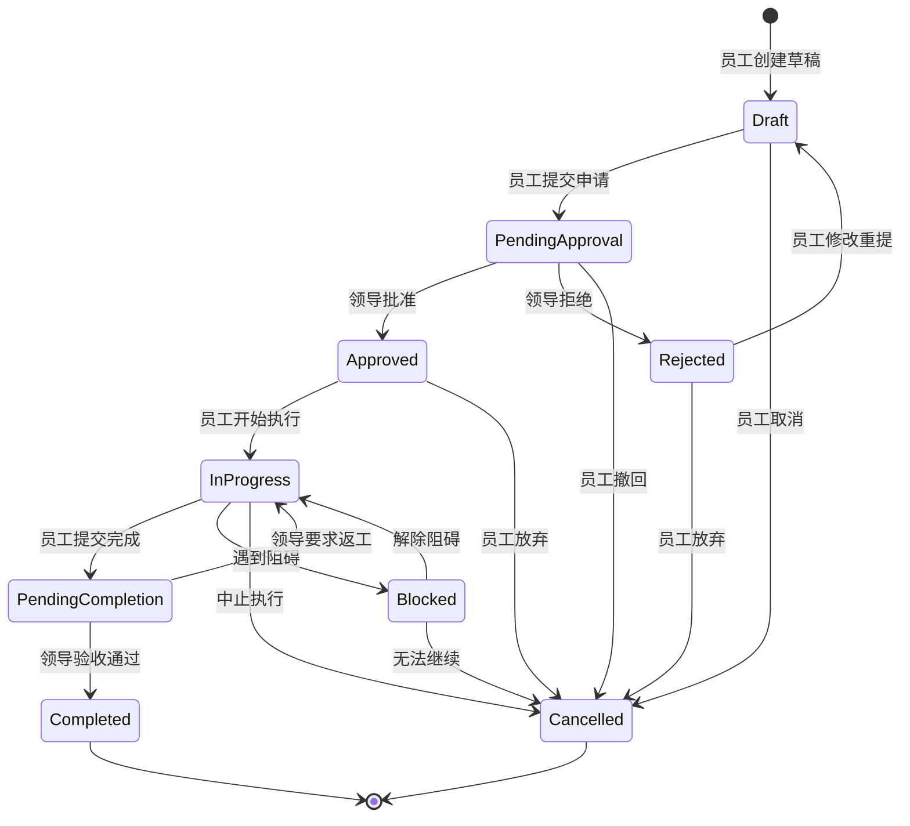
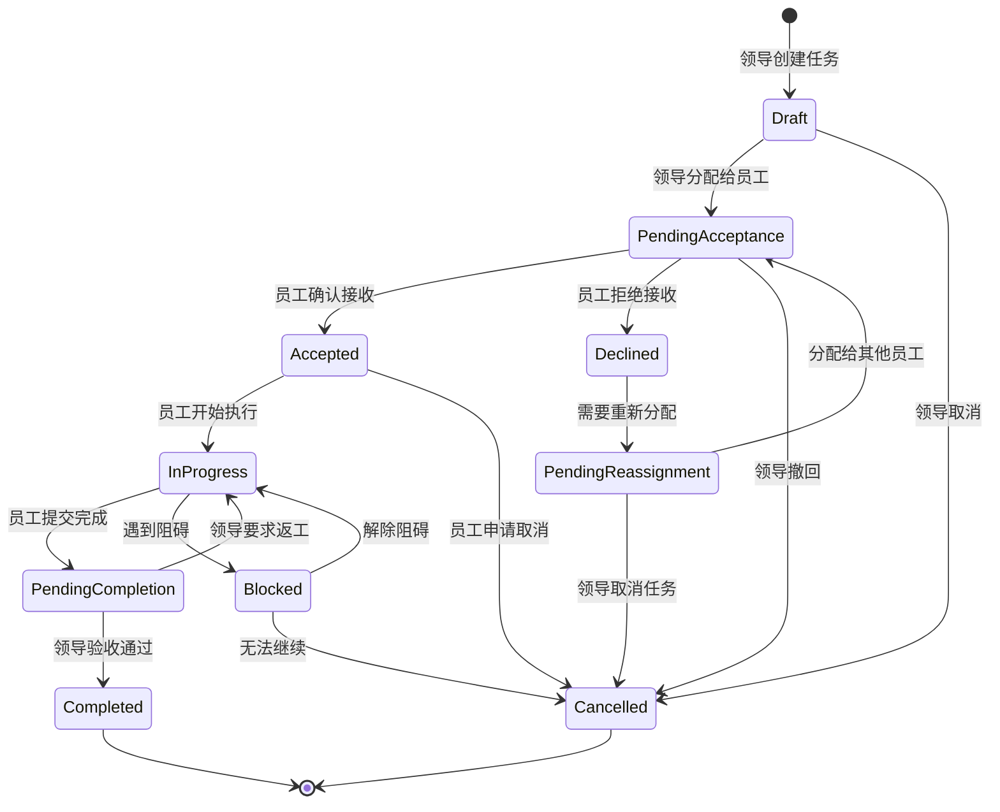

# 任务审批流业务流程重新设计

## 🔄 业务流程分类

根据你的问题，我重新识别出了三种不同的业务流程：

### 1. 任务申请流（员工主动申请）
```
员工创建任务申请 → 领导审批 → 员工执行 → 员工提交完成 → 领导验收审批 → 任务关闭
```

### 2. 任务下达流（领导主动分配）
```
领导创建任务 → 员工确认接收 → 员工执行 → 员工提交完成 → 领导验收审批 → 任务关闭
```

### 3. 任务委派流（平级或跨部门）
```
员工A创建任务 → 部门领导审批 → 分配给员工B → 员工B确认 → 执行 → 提交 → 验收 → 关闭
```

## 📋 重新设计的状态机

### 任务申请流状态机


### 任务下达流状态机


## 🏗️ 重新设计的领域模型

### 任务聚合根重新设计
```go
type Task struct {
    ID          TaskID
    Title       string
    Description string
    TaskType    TaskType        // 申请类型：SELF_APPLY, ASSIGNED, DELEGATED
    Priority    Priority
    
    // 状态信息
    Status      TaskStatus
    
    // 参与人员（根据任务类型不同而不同）
    CreatorID   UserID          // 任务创建者
    ApproverID  UserID          // 审批人
    ExecutorID  UserID          // 实际执行人
    ReviewerID  *UserID         // 验收人（可能与审批人不同）
    
    // 时间信息
    CreatedAt     time.Time
    ApprovedAt    *time.Time
    StartedAt     *time.Time
    SubmittedAt   *time.Time     // 提交完成时间
    CompletedAt   *time.Time     // 验收完成时间
    DueDate       *time.Time
    
    // 审批和验收记录
    ApprovalRecord   *Approval   // 创建时的审批记录
    CompletionRecord *Approval   // 完成时的验收记录
    
    // 重新分配历史
    AssignmentHistory []Assignment
    
    events []DomainEvent
}

// 任务类型枚举
type TaskType int
const (
    TaskTypeSelfApply TaskType = iota  // 员工主动申请
    TaskTypeAssigned                   // 领导分配
    TaskTypeDelegated                  // 委派任务
)

// 重新分配记录
type Assignment struct {
    FromUserID  *UserID    // 原执行人（首次分配时为nil）
    ToUserID    UserID     // 新执行人
    AssignerID  UserID     // 分配人
    Reason      string     // 分配原因
    AssignedAt  time.Time
}
```

### 业务方法重新设计
```go
// 员工申请任务
func (t *Task) SubmitForApproval(creator *User) error {
    if t.TaskType != TaskTypeSelfApply {
        return errors.New("only self-apply tasks can be submitted for approval")
    }
    
    if t.Status != TaskStatusDraft {
        return errors.New("can only submit draft tasks")
    }
    
    t.Status = TaskStatusPendingApproval
    t.AddEvent(&TaskSubmittedEvent{...})
    return nil
}

// 领导分配任务给员工
func (t *Task) AssignToEmployee(assigner *User, executor *User) error {
    if t.TaskType != TaskTypeAssigned {
        return errors.New("only assigned tasks can be assigned to employees")
    }
    
    if t.Status != TaskStatusDraft {
        return errors.New("can only assign draft tasks")
    }
    
    t.ExecutorID = executor.ID
    t.Status = TaskStatusPendingAcceptance
    
    // 记录分配历史
    assignment := Assignment{
        FromUserID:  nil,  // 首次分配
        ToUserID:    executor.ID,
        AssignerID:  assigner.ID,
        Reason:      "initial assignment",
        AssignedAt:  time.Now(),
    }
    t.AssignmentHistory = append(t.AssignmentHistory, assignment)
    
    t.AddEvent(&TaskAssignedEvent{...})
    return nil
}

// 员工确认接收任务
func (t *Task) AcceptTask(executor *User) error {
    if t.ExecutorID != executor.ID {
        return errors.New("only assigned executor can accept the task")
    }
    
    if t.Status != TaskStatusPendingAcceptance {
        return errors.New("task is not pending acceptance")
    }
    
    t.Status = TaskStatusAccepted
    t.AddEvent(&TaskAcceptedEvent{...})
    return nil
}

// 员工拒绝接收任务
func (t *Task) DeclineTask(executor *User, reason string) error {
    if t.ExecutorID != executor.ID {
        return errors.New("only assigned executor can decline the task")
    }
    
    if t.Status != TaskStatusPendingAcceptance {
        return errors.New("task is not pending acceptance")
    }
    
    t.Status = TaskStatusDeclined
    t.AddEvent(&TaskDeclinedEvent{
        TaskID:     t.ID,
        ExecutorID: executor.ID,
        Reason:     reason,
        Timestamp:  time.Now(),
    })
    return nil
}

// 重新分配任务
func (t *Task) ReassignTask(assigner *User, newExecutor *User, reason string) error {
    if !assigner.CanReassignTask(t) {
        return errors.New("insufficient permission to reassign task")
    }
    
    oldExecutorID := t.ExecutorID
    t.ExecutorID = newExecutor.ID
    t.Status = TaskStatusPendingAcceptance
    
    // 记录重新分配历史
    assignment := Assignment{
        FromUserID:  oldExecutorID,
        ToUserID:    newExecutor.ID,
        AssignerID:  assigner.ID,
        Reason:      reason,
        AssignedAt:  time.Now(),
    }
    t.AssignmentHistory = append(t.AssignmentHistory, assignment)
    
    t.AddEvent(&TaskReassignedEvent{...})
    return nil
}

// 员工开始执行任务
func (t *Task) StartExecution(executor *User) error {
    if t.ExecutorID != executor.ID {
        return errors.New("only assigned executor can start the task")
    }
    
    if t.Status != TaskStatusAccepted && t.Status != TaskStatusApproved {
        return errors.New("task must be accepted or approved to start")
    }
    
    t.Status = TaskStatusInProgress
    t.StartedAt = &time.Time{}
    *t.StartedAt = time.Now()
    
    t.AddEvent(&TaskStartedEvent{...})
    return nil
}

// 员工提交任务完成
func (t *Task) SubmitCompletion(executor *User, result string) error {
    if t.ExecutorID != executor.ID {
        return errors.New("only assigned executor can submit completion")
    }
    
    if t.Status != TaskStatusInProgress {
        return errors.New("task must be in progress to submit completion")
    }
    
    t.Status = TaskStatusPendingCompletion
    now := time.Now()
    t.SubmittedAt = &now
    
    t.AddEvent(&TaskCompletionSubmittedEvent{
        TaskID:     t.ID,
        ExecutorID: executor.ID,
        Result:     result,
        Timestamp:  now,
    })
    return nil
}

// 领导验收任务
func (t *Task) ReviewCompletion(reviewer *User, approved bool, comment string) error {
    if !reviewer.CanReviewTask(t) {
        return errors.New("insufficient permission to review task")
    }
    
    if t.Status != TaskStatusPendingCompletion {
        return errors.New("task is not pending completion review")
    }
    
    if approved {
        t.Status = TaskStatusCompleted
        now := time.Now()
        t.CompletedAt = &now
        
        t.CompletionRecord = &Approval{
            ApproverID: reviewer.ID,
            Action:     ApprovalActionApprove,
            Comment:    comment,
            Timestamp:  now,
        }
        
        t.AddEvent(&TaskCompletedEvent{...})
    } else {
        t.Status = TaskStatusInProgress  // 返工
        
        t.CompletionRecord = &Approval{
            ApproverID: reviewer.ID,
            Action:     ApprovalActionReject,
            Comment:    comment,
            Timestamp:  time.Now(),
        }
        
        t.AddEvent(&TaskRejectedForReworkEvent{...})
    }
    
    return nil
}
```

## 🔧 简化的技术架构

### 问题：是否一定需要Kafka和gRPC？

**答案：不一定！** 让我提供一个渐进式的技术选型：

#### 阶段1：最简化版本（适合学习和小团队）
```go
// 使用内存事件总线
type InMemoryEventBus struct {
    handlers map[string][]EventHandler
    mu       sync.RWMutex
}

// 使用Redis作为消息队列
type RedisEventBus struct {
    client *redis.Client
}

func (bus *RedisEventBus) Publish(event DomainEvent) error {
    eventData, _ := json.Marshal(event)
    return bus.client.LPush(context.Background(), "events", eventData).Err()
}

// 只使用HTTP API，不需要gRPC
type TaskController struct {
    taskAppService *TaskAppService
}
```

#### 阶段2：中等规模版本（适合中型团队）
```go
// 使用Redis Stream作为消息队列
type RedisStreamEventBus struct {
    client *redis.Client
}

// 添加简单的HTTP API + WebSocket实时通知
type NotificationService struct {
    websocketHub *WebSocketHub
    emailService *EmailService
}
```

#### 阶段3：企业级版本（大型团队和高并发）
```go
// 使用Kafka + gRPC + 微服务架构
type KafkaEventBus struct {
    producer sarama.SyncProducer
}

type TaskGRPCServer struct {
    taskAppService *TaskAppService
}
```

### 技术选型对比表

| 特性 | 内存事件总线 | Redis消息队列 | Kafka |
|------|-------------|---------------|-------|
| 复杂度 | 低 | 中 | 高 |
| 性能 | 高（内存） | 中 | 高 |
| 持久化 | 无 | 有 | 有 |
| 分布式 | 不支持 | 支持 | 支持 |
| 学习成本 | 低 | 中 | 高 |
| 适用场景 | 学习、原型 | 中小项目 | 大型项目 |

## 📊 重新设计的可信度评分

| 评估维度 | 原设计 | 重新设计 | 改进说明 |
|----------|--------|----------|----------|
| **业务完整性** | 6/10 | 9/10 | ✅ 覆盖了三种业务流程，包含完成验收环节 |
| **流程合理性** | 5/10 | 9/10 | ✅ 区分了申请流和下达流，符合实际业务 |
| **状态机设计** | 7/10 | 9/10 | ✅ 增加了验收状态和重新分配流程 |
| **技术选型** | 6/10 | 8/10 | ✅ 提供渐进式选型，避免过度设计 |
| **实用性** | 7/10 | 9/10 | ✅ 更符合企业实际工作流程 |

## 🎯 解决方案总结

### 对你问题的回答：

1. **任务分配流程**：重新设计了三种不同的业务流程，明确了每种流程的参与者和状态转换
2. **完成审批**：增加了任务完成后的验收审批环节，包含返工机制
3. **领导创建任务流**：这是"任务下达流"，与"任务申请流"是两种不同的业务模式
4. **重新分配**：设计了完整的重新分配机制，包含分配历史记录
5. **技术选型**：提供了渐进式的技术选型方案，从简单到复杂

# RBAC + ABAC 混合权限模型设计

## 🎯 权限模型分析

### 当前RBAC设计的局限性

我们的业务场景中存在复杂的权限判断：
- **项目领导**只能管理**自己负责的项目**内的任务
- **任务负责人**只能管理**自己负责的任务**的参与人员
- **延期审批权限**取决于**申请人角色**和**审批人与申请人的关系**
- **任务查看权限**取决于**用户与项目/任务的关联关系**

这些都是典型的**基于属性和上下文**的权限判断，单纯的RBAC无法很好地处理。

## 🏗️ RBAC + ABAC 混合设计

### 1. RBAC部分（基础角色权限）

```sql
-- 角色定义（已有）
INSERT INTO roles (id, name, description) VALUES
('role_director', 'director', '大领导'),
('role_project_leader', 'project_leader', '项目领导'),
('role_employee', 'employee', '员工');

-- 基础权限定义（已有，但需要补充）
INSERT INTO permissions (id, name, resource, action, description) VALUES
-- 项目管理权限
('perm_project_create', 'project:create', 'project', 'create', '创建项目'),
('perm_project_read', 'project:read', 'project', 'read', '查看项目'),
('perm_project_update', 'project:update', 'project', 'update', '更新项目'),
('perm_project_delete', 'project:delete', 'project', 'delete', '删除项目'),
('perm_project_assign_manager', 'project:assign_manager', 'project', 'assign_manager', '分配项目管理者'),

-- 任务管理权限
('perm_task_create', 'task:create', 'task', 'create', '创建任务'),
('perm_task_read', 'task:read', 'task', 'read', '查看任务'),
('perm_task_update', 'task:update', 'task', 'update', '更新任务'),
('perm_task_delete', 'task:delete', 'task', 'delete', '删除任务'),
('perm_task_assign', 'task:assign', 'task', 'assign', '分配任务'),
('perm_task_approve', 'task:approve', 'task', 'approve', '审批任务'),
('perm_task_execute', 'task:execute', 'task', 'execute', '执行任务'),

-- 团队管理权限
('perm_team_manage', 'team:manage', 'team', 'manage', '管理团队成员'),
('perm_user_manage', 'user:manage', 'user', 'manage', '管理用户'),

-- 延期审批权限
('perm_extension_request', 'extension:request', 'extension', 'request', '申请延期'),
('perm_extension_approve', 'extension:approve', 'extension', 'approve', '审批延期');
```

### 2. ABAC部分（属性和上下文）

#### 属性定义表
```sql
-- 权限属性定义表
CREATE TABLE permission_attributes (
    id VARCHAR(36) PRIMARY KEY,
    name VARCHAR(100) UNIQUE NOT NULL,
    attribute_type ENUM('user', 'resource', 'environment', 'action') NOT NULL,
    data_type ENUM('string', 'number', 'boolean', 'array', 'object') NOT NULL,
    description TEXT,
    created_at TIMESTAMP DEFAULT CURRENT_TIMESTAMP,
    
    INDEX idx_name (name),
    INDEX idx_type (attribute_type)
);

-- 插入属性定义
INSERT INTO permission_attributes (id, name, attribute_type, data_type, description) VALUES
-- 用户属性
('attr_user_id', 'user.id', 'user', 'string', '用户ID'),
('attr_user_role', 'user.role', 'user', 'string', '用户角色'),
('attr_user_department', 'user.department_id', 'user', 'string', '用户部门ID'),
('attr_user_manager', 'user.manager_id', 'user', 'string', '用户直属领导ID'),

-- 资源属性
('attr_project_owner', 'project.owner_id', 'resource', 'string', '项目所有者ID'),
('attr_project_manager', 'project.manager_id', 'resource', 'string', '项目管理者ID'),
('attr_project_members', 'project.member_ids', 'resource', 'array', '项目成员ID列表'),
('attr_task_creator', 'task.creator_id', 'resource', 'string', '任务创建者ID'),
('attr_task_responsible', 'task.responsible_id', 'resource', 'string', '任务负责人ID'),
('attr_task_participants', 'task.participant_ids', 'resource', 'array', '任务参与人员ID列表'),
('attr_task_project', 'task.project_id', 'resource', 'string', '任务所属项目ID'),

-- 环境属性
('attr_time_now', 'env.current_time', 'environment', 'string', '当前时间'),
('attr_ip_address', 'env.ip_address', 'environment', 'string', '请求IP地址'),

-- 动作属性
('attr_action_type', 'action.type', 'action', 'string', '操作类型'),
('attr_action_target', 'action.target_id', 'action', 'string', '操作目标ID');
```

#### 权限策略表
```sql
-- 权限策略表（ABAC规则）
CREATE TABLE permission_policies (
    id VARCHAR(36) PRIMARY KEY,
    name VARCHAR(200) NOT NULL,
    description TEXT,
    resource_type VARCHAR(50) NOT NULL,
    action VARCHAR(50) NOT NULL,
    effect ENUM('allow', 'deny') NOT NULL,
    conditions JSON NOT NULL,
    priority INT DEFAULT 0,
    is_active BOOLEAN DEFAULT TRUE,
    created_at TIMESTAMP DEFAULT CURRENT_TIMESTAMP,
    updated_at TIMESTAMP DEFAULT CURRENT_TIMESTAMP ON UPDATE CURRENT_TIMESTAMP,
    
    INDEX idx_resource_action (resource_type, action),
    INDEX idx_priority (priority),
    INDEX idx_active (is_active)
);

-- 插入ABAC策略规则
INSERT INTO permission_policies (id, name, description, resource_type, action, effect, conditions, priority) VALUES

-- 项目管理策略
('policy_project_owner_full', '项目所有者完全权限', '项目所有者对自己的项目有完全权限', 'project', '*', 'allow', 
 JSON_OBJECT('user.id', JSON_OBJECT('eq', '${resource.owner_id}')), 100),

('policy_project_manager_manage', '项目管理者管理权限', '项目管理者可以管理被分配的项目', 'project', 'update', 'allow',
 JSON_OBJECT('user.id', JSON_OBJECT('eq', '${resource.manager_id}')), 90),

('policy_project_member_read', '项目成员查看权限', '项目成员可以查看项目信息', 'project', 'read', 'allow',
 JSON_OBJECT('user.id', JSON_OBJECT('in', '${resource.member_ids}')), 80),

-- 任务管理策略
('policy_task_responsible_manage', '任务负责人管理权限', '任务负责人可以管理自己负责的任务', 'task', '*', 'allow',
 JSON_OBJECT('user.id', JSON_OBJECT('eq', '${resource.responsible_id}')), 100),

('policy_task_creator_edit', '任务创建者编辑权限', '任务创建者可以编辑草稿状态的任务', 'task', 'update', 'allow',
 JSON_OBJECT(
   'and', JSON_ARRAY(
     JSON_OBJECT('user.id', JSON_OBJECT('eq', '${resource.creator_id}')),
     JSON_OBJECT('resource.status', JSON_OBJECT('eq', 'draft'))
   )
 ), 90),

('policy_task_participant_read', '任务参与者查看权限', '任务参与者可以查看任务详情', 'task', 'read', 'allow',
 JSON_OBJECT('user.id', JSON_OBJECT('in', '${resource.participant_ids}')), 80),

('policy_task_project_manager', '项目管理者任务权限', '项目管理者可以管理项目内的任务', 'task', '*', 'allow',
 JSON_OBJECT('user.id', JSON_OBJECT('eq', '${project.manager_id}')), 85),

-- 延期申请策略
('policy_extension_self_request', '自己申请延期', '用户可以为自己的任务申请延期', 'extension', 'request', 'allow',
 JSON_OBJECT(
   'or', JSON_ARRAY(
     JSON_OBJECT('user.id', JSON_OBJECT('eq', '${task.responsible_id}')),
     JSON_OBJECT('user.id', JSON_OBJECT('in', '${task.participant_ids}'))
   )
 ), 100),

('policy_extension_responsible_approve', '任务负责人审批延期', '任务负责人可以审批参与人员的延期申请', 'extension', 'approve', 'allow',
 JSON_OBJECT(
   'and', JSON_ARRAY(
     JSON_OBJECT('user.id', JSON_OBJECT('eq', '${task.responsible_id}')),
     JSON_OBJECT('extension.requester_id', JSON_OBJECT('in', '${task.participant_ids}'))
   )
 ), 100),

('policy_extension_project_leader_approve', '项目领导审批负责人延期', '项目领导可以审批任务负责人的延期申请', 'extension', 'approve', 'allow',
 JSON_OBJECT(
   'and', JSON_ARRAY(
     JSON_OBJECT('user.id', JSON_OBJECT('eq', '${project.manager_id}')),
     JSON_OBJECT('extension.requester_id', JSON_OBJECT('eq', '${task.responsible_id}'))
   )
 ), 90),

('policy_extension_director_approve', '大领导审批延期', '大领导可以审批任何延期申请', 'extension', 'approve', 'allow',
 JSON_OBJECT('user.role', JSON_OBJECT('eq', 'director')), 95);
```

### 3. 权限评估引擎

#### Go代码实现
```go
// 权限评估服务
type PermissionEvaluator struct {
    policyRepo PolicyRepository
    attrRepo   AttributeRepository
    cache      Cache
}

// 权限评估上下文
type EvaluationContext struct {
    User        *User                  `json:"user"`
    Resource    map[string]interface{} `json:"resource"`
    Action      string                 `json:"action"`
    Environment map[string]interface{} `json:"environment"`
}

// 权限策略
type Policy struct {
    ID           string                 `json:"id"`
    Name         string                 `json:"name"`
    ResourceType string                 `json:"resource_type"`
    Action       string                 `json:"action"`
    Effect       string                 `json:"effect"` // allow, deny
    Conditions   map[string]interface{} `json:"conditions"`
    Priority     int                    `json:"priority"`
    IsActive     bool                   `json:"is_active"`
}

// 权限评估主方法
func (e *PermissionEvaluator) Evaluate(ctx *EvaluationContext) (bool, error) {
    // 1. 获取适用的策略
    policies, err := e.getApplicablePolicies(ctx.Resource["type"].(string), ctx.Action)
    if err != nil {
        return false, err
    }
    
    // 2. 按优先级排序
    sort.Slice(policies, func(i, j int) bool {
        return policies[i].Priority > policies[j].Priority
    })
    
    // 3. 逐个评估策略
    for _, policy := range policies {
        if !policy.IsActive {
            continue
        }
        
        match, err := e.evaluateConditions(policy.Conditions, ctx)
        if err != nil {
            continue // 评估错误，跳过该策略
        }
        
        if match {
            return policy.Effect == "allow", nil
        }
    }
    
    // 4. 默认拒绝
    return false, nil
}

// 条件评估
func (e *PermissionEvaluator) evaluateConditions(
    conditions map[string]interface{}, 
    ctx *EvaluationContext,
) (bool, error) {
    return e.evaluateCondition(conditions, ctx)
}

func (e *PermissionEvaluator) evaluateCondition(
    condition interface{}, 
    ctx *EvaluationContext,
) (bool, error) {
    switch cond := condition.(type) {
    case map[string]interface{}:
        // 处理逻辑操作符
        if andConditions, ok := cond["and"]; ok {
            return e.evaluateAndCondition(andConditions, ctx)
        }
        if orConditions, ok := cond["or"]; ok {
            return e.evaluateOrCondition(orConditions, ctx)
        }
        if notCondition, ok := cond["not"]; ok {
            result, err := e.evaluateCondition(notCondition, ctx)
            return !result, err
        }
        
        // 处理属性比较
        for attr, comparison := range cond {
            return e.evaluateComparison(attr, comparison, ctx)
        }
    }
    
    return false, fmt.Errorf("unsupported condition type")
}

func (e *PermissionEvaluator) evaluateAndCondition(
    conditions interface{}, 
    ctx *EvaluationContext,
) (bool, error) {
    condArray, ok := conditions.([]interface{})
    if !ok {
        return false, fmt.Errorf("and condition must be an array")
    }
    
    for _, cond := range condArray {
        result, err := e.evaluateCondition(cond, ctx)
        if err != nil {
            return false, err
        }
        if !result {
            return false, nil
        }
    }
    return true, nil
}

func (e *PermissionEvaluator) evaluateOrCondition(
    conditions interface{}, 
    ctx *EvaluationContext,
) (bool, error) {
    condArray, ok := conditions.([]interface{})
    if !ok {
        return false, fmt.Errorf("or condition must be an array")
    }
    
    for _, cond := range condArray {
        result, err := e.evaluateCondition(cond, ctx)
        if err != nil {
            continue // 忽略错误，继续下一个条件
        }
        if result {
            return true, nil
        }
    }
    return false, nil
}

func (e *PermissionEvaluator) evaluateComparison(
    attribute string, 
    comparison interface{}, 
    ctx *EvaluationContext,
) (bool, error) {
    // 获取属性值
    attrValue, err := e.getAttributeValue(attribute, ctx)
    if err != nil {
        return false, err
    }
    
    compMap, ok := comparison.(map[string]interface{})
    if !ok {
        return false, fmt.Errorf("comparison must be an object")
    }
    
    for operator, expectedValue := range compMap {
        return e.applyOperator(attrValue, operator, expectedValue, ctx)
    }
    
    return false, nil
}

func (e *PermissionEvaluator) getAttributeValue(
    attribute string, 
    ctx *EvaluationContext,
) (interface{}, error) {
    // 解析属性路径，如 "user.id", "resource.owner_id", "task.responsible_id"
    parts := strings.Split(attribute, ".")
    if len(parts) < 2 {
        return nil, fmt.Errorf("invalid attribute format: %s", attribute)
    }
    
    var source map[string]interface{}
    switch parts[0] {
    case "user":
        userMap, _ := json.Marshal(ctx.User)
        json.Unmarshal(userMap, &source)
    case "resource":
        source = ctx.Resource
    case "env", "environment":
        source = ctx.Environment
    case "project":
        // 需要根据task.project_id获取project信息
        if projectID, ok := ctx.Resource["project_id"].(string); ok {
            project, err := e.getProjectInfo(projectID)
            if err != nil {
                return nil, err
            }
            projectMap, _ := json.Marshal(project)
            json.Unmarshal(projectMap, &source)
        }
    case "task":
        // 如果是extension资源，需要获取对应的task信息
        if ctx.Resource["type"] == "extension" {
            if taskID, ok := ctx.Resource["task_id"].(string); ok {
                task, err := e.getTaskInfo(taskID)
                if err != nil {
                    return nil, err
                }
                taskMap, _ := json.Marshal(task)
                json.Unmarshal(taskMap, &source)
            }
        } else {
            source = ctx.Resource
        }
    default:
        return nil, fmt.Errorf("unknown attribute source: %s", parts[0])
    }
    
    // 获取嵌套属性值
    value := source
    for i := 1; i < len(parts); i++ {
        if nextValue, ok := value[parts[i]]; ok {
            if i == len(parts)-1 {
                return nextValue, nil
            }
            if nextMap, ok := nextValue.(map[string]interface{}); ok {
                value = nextMap
            } else {
                return nil, fmt.Errorf("cannot access nested attribute: %s", attribute)
            }
        } else {
            return nil, fmt.Errorf("attribute not found: %s", attribute)
        }
    }
    
    return nil, fmt.Errorf("attribute value not found: %s", attribute)
}

func (e *PermissionEvaluator) applyOperator(
    attrValue interface{}, 
    operator string, 
    expectedValue interface{}, 
    ctx *EvaluationContext,
) (bool, error) {
    // 处理变量替换，如 "${resource.owner_id}"
    if expectedStr, ok := expectedValue.(string); ok {
        if strings.HasPrefix(expectedStr, "${") && strings.HasSuffix(expectedStr, "}") {
            varPath := strings.TrimSuffix(strings.TrimPrefix(expectedStr, "${"), "}")
            resolvedValue, err := e.getAttributeValue(varPath, ctx)
            if err != nil {
                return false, err
            }
            expectedValue = resolvedValue
        }
    }
    
    switch operator {
    case "eq", "equals":
        return reflect.DeepEqual(attrValue, expectedValue), nil
    case "ne", "not_equals":
        return !reflect.DeepEqual(attrValue, expectedValue), nil
    case "in":
        return e.checkInArray(attrValue, expectedValue)
    case "not_in":
        result, err := e.checkInArray(attrValue, expectedValue)
        return !result, err
    case "gt", "greater_than":
        return e.compareNumbers(attrValue, expectedValue, ">")
    case "gte", "greater_than_or_equal":
        return e.compareNumbers(attrValue, expectedValue, ">=")
    case "lt", "less_than":
        return e.compareNumbers(attrValue, expectedValue, "<")
    case "lte", "less_than_or_equal":
        return e.compareNumbers(attrValue, expectedValue, "<=")
    case "contains":
        return e.checkContains(attrValue, expectedValue)
    case "starts_with":
        return e.checkStartsWith(attrValue, expectedValue)
    case "ends_with":
        return e.checkEndsWith(attrValue, expectedValue)
    default:
        return false, fmt.Errorf("unsupported operator: %s", operator)
    }
}

// 辅助方法实现
func (e *PermissionEvaluator) checkInArray(value, array interface{}) (bool, error) {
    arrayValue := reflect.ValueOf(array)
    if arrayValue.Kind() != reflect.Slice && arrayValue.Kind() != reflect.Array {
        return false, fmt.Errorf("expected array for 'in' operator")
    }
    
    for i := 0; i < arrayValue.Len(); i++ {
        if reflect.DeepEqual(value, arrayValue.Index(i).Interface()) {
            return true, nil
        }
    }
    return false, nil
}

// 权限检查的便捷方法
func (e *PermissionEvaluator) CanUserAccessProject(userID, projectID string) (bool, error) {
    user, err := e.getUserInfo(userID)
    if err != nil {
        return false, err
    }
    
    project, err := e.getProjectInfo(projectID)
    if err != nil {
        return false, err
    }
    
    ctx := &EvaluationContext{
        User: user,
        Resource: map[string]interface{}{
            "type":       "project",
            "id":         project.ID,
            "owner_id":   project.OwnerID,
            "manager_id": project.ManagerID,
            "member_ids": project.GetMemberIDs(),
        },
        Action: "read",
        Environment: map[string]interface{}{
            "current_time": time.Now().Format(time.RFC3339),
        },
    }
    
    return e.Evaluate(ctx)
}

func (e *PermissionEvaluator) CanUserManageTask(userID, taskID string) (bool, error) {
    user, err := e.getUserInfo(userID)
    if err != nil {
        return false, err
    }
    
    task, err := e.getTaskInfo(taskID)
    if err != nil {
        return false, err
    }
    
    project, err := e.getProjectInfo(task.ProjectID)
    if err != nil {
        return false, err
    }
    
    ctx := &EvaluationContext{
        User: user,
        Resource: map[string]interface{}{
            "type":            "task",
            "id":              task.ID,
            "creator_id":      task.CreatorID,
            "responsible_id":  task.ResponsibleID,
            "participant_ids": task.ParticipantIDs,
            "project_id":      task.ProjectID,
            "status":          task.Status,
        },
        Action: "update",
        Environment: map[string]interface{}{
            "current_time": time.Now().Format(time.RFC3339),
        },
    }
    
    // 添加项目信息到上下文
    ctx.Resource["project"] = map[string]interface{}{
        "owner_id":   project.OwnerID,
        "manager_id": project.ManagerID,
    }
    
    return e.Evaluate(ctx)
}
```

## 🔧 其他技术细节补充

### 1. 大文件上传和断点续传

#### 文件上传API设计
```http
# 初始化上传
POST /api/v1/files/upload/init
Content-Type: application/json
{
  "filename": "document.pdf",
  "size": 10485760,
  "content_type": "application/pdf",
  "chunk_size": 1048576
}

# 上传分片
PUT /api/v1/files/upload/{upload_id}/chunks/{chunk_number}
Content-Type: application/octet-stream
Content-Range: bytes 0-1048575/10485760

# 完成上传
POST /api/v1/files/upload/{upload_id}/complete
{
  "chunks": [1, 2, 3, 4, 5, 6, 7, 8, 9, 10]
}

# 查询上传状态
GET /api/v1/files/upload/{upload_id}/status
```

#### 数据库设计
```sql
-- 文件上传记录表
CREATE TABLE file_uploads (
    id VARCHAR(36) PRIMARY KEY,
    filename VARCHAR(500) NOT NULL,
    original_filename VARCHAR(500) NOT NULL,
    content_type VARCHAR(200),
    file_size BIGINT NOT NULL,
    chunk_size INT DEFAULT 1048576,
    total_chunks INT NOT NULL,
    uploaded_chunks JSON,
    status ENUM('pending', 'uploading', 'completed', 'failed') DEFAULT 'pending',
    file_path VARCHAR(1000),
    uploader_id VARCHAR(36),
    created_at TIMESTAMP DEFAULT CURRENT_TIMESTAMP,
    completed_at TIMESTAMP NULL,
    
    FOREIGN KEY (uploader_id) REFERENCES users(id),
    INDEX idx_uploader (uploader_id),
    INDEX idx_status (status),
    INDEX idx_created_at (created_at)
);

-- 文件关联表（任务附件、用户头像等）
CREATE TABLE file_attachments (
    id VARCHAR(36) PRIMARY KEY,
    file_id VARCHAR(36) NOT NULL,
    resource_type VARCHAR(50) NOT NULL,
    resource_id VARCHAR(36) NOT NULL,
    attachment_type VARCHAR(50) NOT NULL,
    created_at TIMESTAMP DEFAULT CURRENT_TIMESTAMP,
    
    FOREIGN KEY (file_id) REFERENCES file_uploads(id) ON DELETE CASCADE,
    INDEX idx_resource (resource_type, resource_id),
    INDEX idx_file (file_id)
);
```

### 2. MySQL全文搜索设计

```sql
-- 为任务表添加全文索引
ALTER TABLE tasks ADD FULLTEXT INDEX ft_title_description (title, description);

-- 为项目表添加全文索引  
ALTER TABLE projects ADD FULLTEXT INDEX ft_name_description (name, description);

-- 搜索API实现
SELECT t.*, p.name as project_name,
       MATCH(t.title, t.description) AGAINST(? IN NATURAL LANGUAGE MODE) as relevance_score
FROM tasks t
JOIN projects p ON t.project_id = p.id
WHERE MATCH(t.title, t.description) AGAINST(? IN NATURAL LANGUAGE MODE)
   OR MATCH(p.name, p.description) AGAINST(? IN NATURAL LANGUAGE MODE)
ORDER BY relevance_score DESC
LIMIT 20;
```

### 3. 企业级测试方案设计

#### 测试架构
```
测试金字塔
    ┌─────────────┐
    │   E2E Tests │  (少量，关键业务流程)
    │   (5-10%)   │
    └─────────────┘
    ┌─────────────┐
    │Integration  │  (中量，API和数据库集成)
    │   Tests     │
    │   (20-30%)  │
    └─────────────┘
    ┌─────────────┐
    │ Unit Tests  │  (大量，业务逻辑和领域模型)
    │   (60-75%)  │
    └─────────────┘
```

#### 测试目录结构
```
test/
├── unit/                   # 单元测试
│   ├── domain/            # 领域层测试
│   ├── application/       # 应用服务层测试
│   └── infrastructure/    # 基础设施层测试
├── integration/           # 集成测试
│   ├── api/              # API集成测试
│   ├── database/         # 数据库集成测试
│   └── external/         # 外部服务集成测试
├── e2e/                  # 端到端测试
│   ├── scenarios/        # 业务场景测试
│   └── fixtures/         # 测试数据
├── performance/          # 性能测试
└── testdata/            # 测试数据和Mock
    ├── fixtures/
    └── mocks/
```

## ✅ 需求确认总结

基于你的确认，我理解我们需要：

1. **权限系统**：RBAC + ABAC混合模型，支持复杂的属性和上下文判断
2. **文件系统**：本地存储 + 大文件分片上传 + 断点续传
3. **搜索功能**：MySQL FULLTEXT索引实现
4. **测试体系**：完整的单元测试、集成测试、E2E测试方案
5. **API文档**：Swagger/OpenAPI文档自动生成


