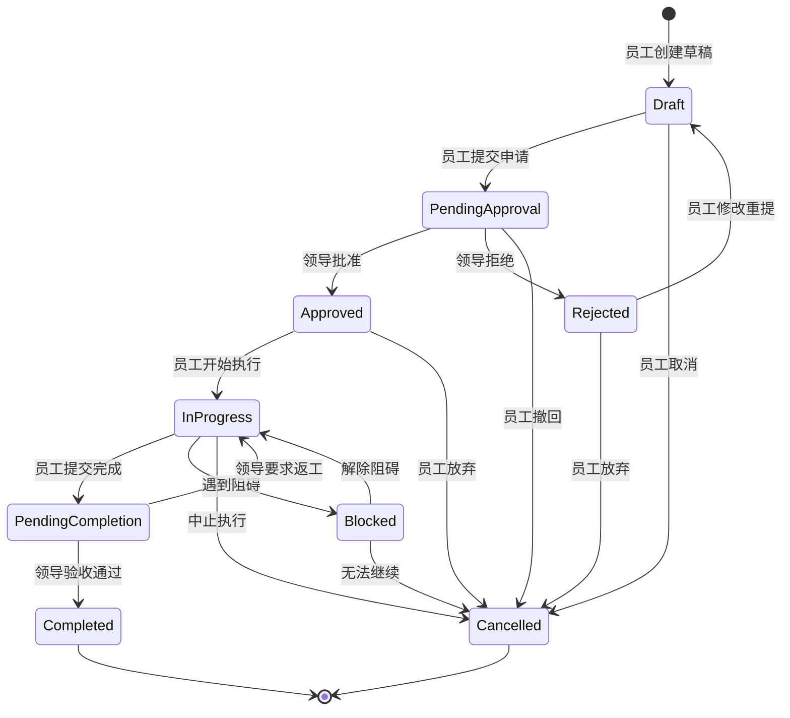
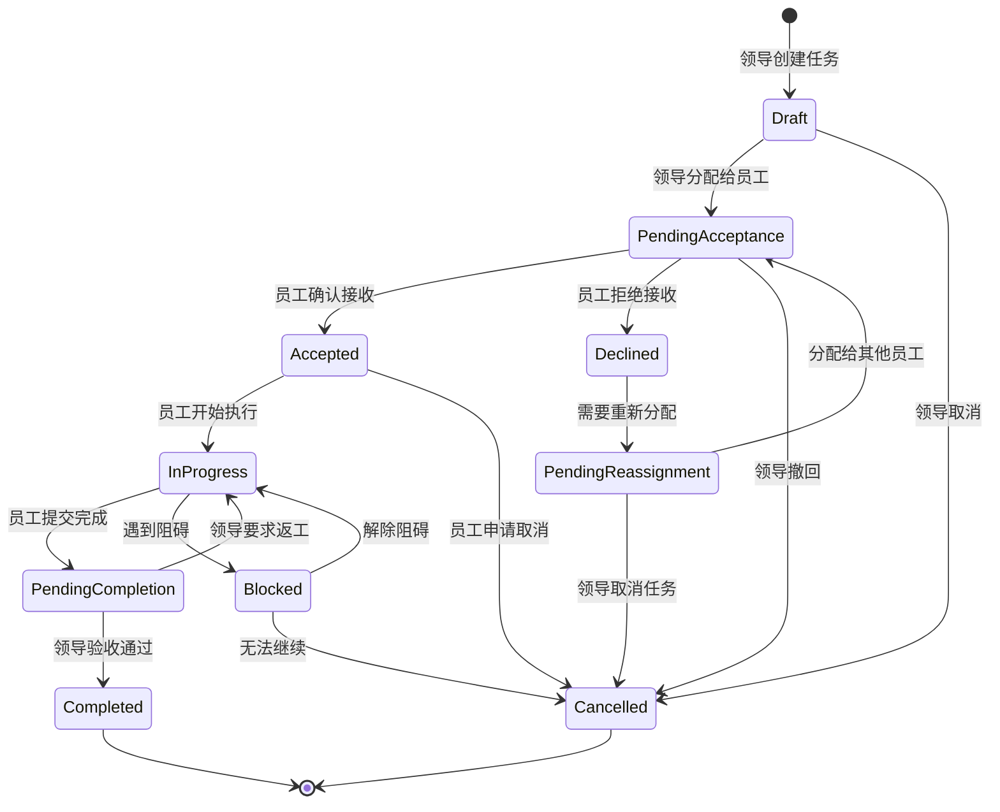

# 任务审批流业务流程重新设计

## 🔄 业务流程分类

根据你的问题，我重新识别出了三种不同的业务流程：

### 1. 任务申请流（员工主动申请）
```
员工创建任务申请 → 领导审批 → 员工执行 → 员工提交完成 → 领导验收审批 → 任务关闭
```

### 2. 任务下达流（领导主动分配）
```
领导创建任务 → 员工确认接收 → 员工执行 → 员工提交完成 → 领导验收审批 → 任务关闭
```

### 3. 任务委派流（平级或跨部门）
```
员工A创建任务 → 部门领导审批 → 分配给员工B → 员工B确认 → 执行 → 提交 → 验收 → 关闭
```

## 📋 重新设计的状态机

### 任务申请流状态机


### 任务下达流状态机


## 🏗️ 重新设计的领域模型

### 任务聚合根重新设计
```go
type Task struct {
    ID          TaskID
    Title       string
    Description string
    TaskType    TaskType        // 申请类型：SELF_APPLY, ASSIGNED, DELEGATED
    Priority    Priority
    
    // 状态信息
    Status      TaskStatus
    
    // 参与人员（根据任务类型不同而不同）
    CreatorID   UserID          // 任务创建者
    ApproverID  UserID          // 审批人
    ExecutorID  UserID          // 实际执行人
    ReviewerID  *UserID         // 验收人（可能与审批人不同）
    
    // 时间信息
    CreatedAt     time.Time
    ApprovedAt    *time.Time
    StartedAt     *time.Time
    SubmittedAt   *time.Time     // 提交完成时间
    CompletedAt   *time.Time     // 验收完成时间
    DueDate       *time.Time
    
    // 审批和验收记录
    ApprovalRecord   *Approval   // 创建时的审批记录
    CompletionRecord *Approval   // 完成时的验收记录
    
    // 重新分配历史
    AssignmentHistory []Assignment
    
    events []DomainEvent
}

// 任务类型枚举
type TaskType int
const (
    TaskTypeSelfApply TaskType = iota  // 员工主动申请
    TaskTypeAssigned                   // 领导分配
    TaskTypeDelegated                  // 委派任务
)

// 重新分配记录
type Assignment struct {
    FromUserID  *UserID    // 原执行人（首次分配时为nil）
    ToUserID    UserID     // 新执行人
    AssignerID  UserID     // 分配人
    Reason      string     // 分配原因
    AssignedAt  time.Time
}
```

### 业务方法重新设计
```go
// 员工申请任务
func (t *Task) SubmitForApproval(creator *User) error {
    if t.TaskType != TaskTypeSelfApply {
        return errors.New("only self-apply tasks can be submitted for approval")
    }
    
    if t.Status != TaskStatusDraft {
        return errors.New("can only submit draft tasks")
    }
    
    t.Status = TaskStatusPendingApproval
    t.AddEvent(&TaskSubmittedEvent{...})
    return nil
}

// 领导分配任务给员工
func (t *Task) AssignToEmployee(assigner *User, executor *User) error {
    if t.TaskType != TaskTypeAssigned {
        return errors.New("only assigned tasks can be assigned to employees")
    }
    
    if t.Status != TaskStatusDraft {
        return errors.New("can only assign draft tasks")
    }
    
    t.ExecutorID = executor.ID
    t.Status = TaskStatusPendingAcceptance
    
    // 记录分配历史
    assignment := Assignment{
        FromUserID:  nil,  // 首次分配
        ToUserID:    executor.ID,
        AssignerID:  assigner.ID,
        Reason:      "initial assignment",
        AssignedAt:  time.Now(),
    }
    t.AssignmentHistory = append(t.AssignmentHistory, assignment)
    
    t.AddEvent(&TaskAssignedEvent{...})
    return nil
}

// 员工确认接收任务
func (t *Task) AcceptTask(executor *User) error {
    if t.ExecutorID != executor.ID {
        return errors.New("only assigned executor can accept the task")
    }
    
    if t.Status != TaskStatusPendingAcceptance {
        return errors.New("task is not pending acceptance")
    }
    
    t.Status = TaskStatusAccepted
    t.AddEvent(&TaskAcceptedEvent{...})
    return nil
}

// 员工拒绝接收任务
func (t *Task) DeclineTask(executor *User, reason string) error {
    if t.ExecutorID != executor.ID {
        return errors.New("only assigned executor can decline the task")
    }
    
    if t.Status != TaskStatusPendingAcceptance {
        return errors.New("task is not pending acceptance")
    }
    
    t.Status = TaskStatusDeclined
    t.AddEvent(&TaskDeclinedEvent{
        TaskID:     t.ID,
        ExecutorID: executor.ID,
        Reason:     reason,
        Timestamp:  time.Now(),
    })
    return nil
}

// 重新分配任务
func (t *Task) ReassignTask(assigner *User, newExecutor *User, reason string) error {
    if !assigner.CanReassignTask(t) {
        return errors.New("insufficient permission to reassign task")
    }
    
    oldExecutorID := t.ExecutorID
    t.ExecutorID = newExecutor.ID
    t.Status = TaskStatusPendingAcceptance
    
    // 记录重新分配历史
    assignment := Assignment{
        FromUserID:  oldExecutorID,
        ToUserID:    newExecutor.ID,
        AssignerID:  assigner.ID,
        Reason:      reason,
        AssignedAt:  time.Now(),
    }
    t.AssignmentHistory = append(t.AssignmentHistory, assignment)
    
    t.AddEvent(&TaskReassignedEvent{...})
    return nil
}

// 员工开始执行任务
func (t *Task) StartExecution(executor *User) error {
    if t.ExecutorID != executor.ID {
        return errors.New("only assigned executor can start the task")
    }
    
    if t.Status != TaskStatusAccepted && t.Status != TaskStatusApproved {
        return errors.New("task must be accepted or approved to start")
    }
    
    t.Status = TaskStatusInProgress
    t.StartedAt = &time.Time{}
    *t.StartedAt = time.Now()
    
    t.AddEvent(&TaskStartedEvent{...})
    return nil
}

// 员工提交任务完成
func (t *Task) SubmitCompletion(executor *User, result string) error {
    if t.ExecutorID != executor.ID {
        return errors.New("only assigned executor can submit completion")
    }
    
    if t.Status != TaskStatusInProgress {
        return errors.New("task must be in progress to submit completion")
    }
    
    t.Status = TaskStatusPendingCompletion
    now := time.Now()
    t.SubmittedAt = &now
    
    t.AddEvent(&TaskCompletionSubmittedEvent{
        TaskID:     t.ID,
        ExecutorID: executor.ID,
        Result:     result,
        Timestamp:  now,
    })
    return nil
}

// 领导验收任务
func (t *Task) ReviewCompletion(reviewer *User, approved bool, comment string) error {
    if !reviewer.CanReviewTask(t) {
        return errors.New("insufficient permission to review task")
    }
    
    if t.Status != TaskStatusPendingCompletion {
        return errors.New("task is not pending completion review")
    }
    
    if approved {
        t.Status = TaskStatusCompleted
        now := time.Now()
        t.CompletedAt = &now
        
        t.CompletionRecord = &Approval{
            ApproverID: reviewer.ID,
            Action:     ApprovalActionApprove,
            Comment:    comment,
            Timestamp:  now,
        }
        
        t.AddEvent(&TaskCompletedEvent{...})
    } else {
        t.Status = TaskStatusInProgress  // 返工
        
        t.CompletionRecord = &Approval{
            ApproverID: reviewer.ID,
            Action:     ApprovalActionReject,
            Comment:    comment,
            Timestamp:  time.Now(),
        }
        
        t.AddEvent(&TaskRejectedForReworkEvent{...})
    }
    
    return nil
}
```

## 🔧 简化的技术架构

### 问题：是否一定需要Kafka和gRPC？

**答案：不一定！** 让我提供一个渐进式的技术选型：

#### 阶段1：最简化版本（适合学习和小团队）
```go
// 使用内存事件总线
type InMemoryEventBus struct {
    handlers map[string][]EventHandler
    mu       sync.RWMutex
}

// 使用Redis作为消息队列
type RedisEventBus struct {
    client *redis.Client
}

func (bus *RedisEventBus) Publish(event DomainEvent) error {
    eventData, _ := json.Marshal(event)
    return bus.client.LPush(context.Background(), "events", eventData).Err()
}

// 只使用HTTP API，不需要gRPC
type TaskController struct {
    taskAppService *TaskAppService
}
```

#### 阶段2：中等规模版本（适合中型团队）
```go
// 使用Redis Stream作为消息队列
type RedisStreamEventBus struct {
    client *redis.Client
}

// 添加简单的HTTP API + WebSocket实时通知
type NotificationService struct {
    websocketHub *WebSocketHub
    emailService *EmailService
}
```

#### 阶段3：企业级版本（大型团队和高并发）
```go
// 使用Kafka + gRPC + 微服务架构
type KafkaEventBus struct {
    producer sarama.SyncProducer
}

type TaskGRPCServer struct {
    taskAppService *TaskAppService
}
```

### 技术选型对比表

| 特性 | 内存事件总线 | Redis消息队列 | Kafka |
|------|-------------|---------------|-------|
| 复杂度 | 低 | 中 | 高 |
| 性能 | 高（内存） | 中 | 高 |
| 持久化 | 无 | 有 | 有 |
| 分布式 | 不支持 | 支持 | 支持 |
| 学习成本 | 低 | 中 | 高 |
| 适用场景 | 学习、原型 | 中小项目 | 大型项目 |

## 📊 重新设计的可信度评分

| 评估维度 | 原设计 | 重新设计 | 改进说明 |
|----------|--------|----------|----------|
| **业务完整性** | 6/10 | 9/10 | ✅ 覆盖了三种业务流程，包含完成验收环节 |
| **流程合理性** | 5/10 | 9/10 | ✅ 区分了申请流和下达流，符合实际业务 |
| **状态机设计** | 7/10 | 9/10 | ✅ 增加了验收状态和重新分配流程 |
| **技术选型** | 6/10 | 8/10 | ✅ 提供渐进式选型，避免过度设计 |
| **实用性** | 7/10 | 9/10 | ✅ 更符合企业实际工作流程 |

## 🎯 解决方案总结

### 对你问题的回答：

1. **任务分配流程**：重新设计了三种不同的业务流程，明确了每种流程的参与者和状态转换
2. **完成审批**：增加了任务完成后的验收审批环节，包含返工机制
3. **领导创建任务流**：这是"任务下达流"，与"任务申请流"是两种不同的业务模式
4. **重新分配**：设计了完整的重新分配机制，包含分配历史记录
5. **技术选型**：提供了渐进式的技术选型方案，从简单到复杂

这个重新设计更加贴近实际业务场景，技术选型也更加务实。你觉得这个方案如何？还有哪些地方需要进一步调整？
