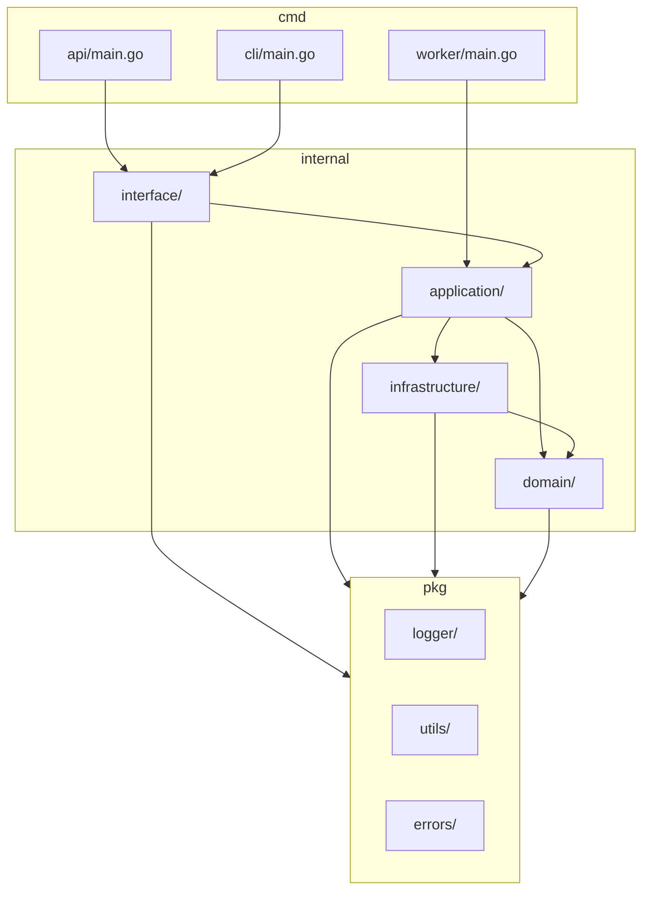

# 多层级项目管理系统技术实施方案

## 🎯 技术栈选型

### 阶段1：MVP版本（学习和验证）

#### 后端技术栈
```go
核心框架：
├── Go 1.21+                    // 编程语言
├── Gin 1.9+                    // HTTP框架
├── GORM 1.25+                  // ORM框架
├── Wire 0.5+                   // 依赖注入
├── Viper 1.16+                 // 配置管理
└── Zap 1.24+                   // 日志框架

数据存储：
├── MySQL 8.0+                  // 主数据库
├── Redis 7.0+                  // 缓存和会话
└── 内存EventBus                // 事件总线（简化版）

工具库：
├── UUID 1.3+                   // 唯一ID生成
├── JWT-Go 4.5+                 // 认证token
├── Validator 10.14+            // 数据验证
├── Testify 1.8+                // 测试框架
└── Air 1.45+                   // 热重载（开发环境）
```

#### 前端技术栈（可选）
```javascript
基础框架：
├── Vue.js 3.3+                 // 前端框架
├── Vue Router 4.2+             // 路由管理
├── Pinia 2.1+                  // 状态管理
├── Element Plus 2.3+           // UI组件库
└── Axios 1.4+                  // HTTP客户端

开发工具：
├── Vite 4.4+                   // 构建工具
├── TypeScript 5.1+             // 类型系统
├── ESLint 8.44+                // 代码检查
└── Prettier 3.0+               // 代码格式化
```

#### 部署和运维
```yaml
容器化：
├── Docker 24.0+                // 容器运行时
├── Docker Compose 2.20+        // 本地编排
└── Dockerfile多阶段构建        // 镜像优化

监控和日志：
├── Prometheus 2.45+            // 指标监控
├── Grafana 10.0+               // 监控面板
├── Jaeger 1.47+                // 链路追踪
└── ELK Stack                   // 日志收集分析

部署方案：
├── 本地开发：Docker Compose
├── 测试环境：单机部署
└── 生产环境：Kubernetes（后期）
```

### 阶段2：生产版本（扩展和优化）

#### 消息队列升级
```go
从内存EventBus升级到：
├── Redis Stream               // 轻量级消息队列
└── Apache Kafka              // 大规模消息队列（可选）
```

#### 数据库优化
```sql
读写分离：
├── MySQL主从复制
├── 读写分离中间件
└── 分库分表策略

缓存策略：
├── Redis集群
├── 多级缓存
└── 缓存预热
```

## 📊 数据库设计

### 核心表结构

#### 1. 用户和权限表
```sql
-- 用户表
CREATE TABLE users (
    id VARCHAR(36) PRIMARY KEY,
    name VARCHAR(100) NOT NULL,
    email VARCHAR(255) UNIQUE NOT NULL,
    password_hash VARCHAR(255) NOT NULL,
    avatar_url VARCHAR(500),
    status ENUM('active', 'inactive', 'suspended') DEFAULT 'active',
    created_at TIMESTAMP DEFAULT CURRENT_TIMESTAMP,
    updated_at TIMESTAMP DEFAULT CURRENT_TIMESTAMP ON UPDATE CURRENT_TIMESTAMP,
    INDEX idx_email (email),
    INDEX idx_status (status)
);

-- 角色表
CREATE TABLE roles (
    id VARCHAR(36) PRIMARY KEY,
    name VARCHAR(50) UNIQUE NOT NULL,
    description TEXT,
    created_at TIMESTAMP DEFAULT CURRENT_TIMESTAMP
);

-- 用户角色关联表
CREATE TABLE user_roles (
    user_id VARCHAR(36),
    role_id VARCHAR(36),
    assigned_at TIMESTAMP DEFAULT CURRENT_TIMESTAMP,
    assigned_by VARCHAR(36),
    PRIMARY KEY (user_id, role_id),
    FOREIGN KEY (user_id) REFERENCES users(id) ON DELETE CASCADE,
    FOREIGN KEY (role_id) REFERENCES roles(id) ON DELETE CASCADE,
    FOREIGN KEY (assigned_by) REFERENCES users(id)
);

-- 权限表
CREATE TABLE permissions (
    id VARCHAR(36) PRIMARY KEY,
    name VARCHAR(100) UNIQUE NOT NULL,
    resource VARCHAR(50) NOT NULL,
    action VARCHAR(50) NOT NULL,
    description TEXT,
    created_at TIMESTAMP DEFAULT CURRENT_TIMESTAMP,
    INDEX idx_resource_action (resource, action)
);

-- 角色权限关联表
CREATE TABLE role_permissions (
    role_id VARCHAR(36),
    permission_id VARCHAR(36),
    PRIMARY KEY (role_id, permission_id),
    FOREIGN KEY (role_id) REFERENCES roles(id) ON DELETE CASCADE,
    FOREIGN KEY (permission_id) REFERENCES permissions(id) ON DELETE CASCADE
);
```

#### 2. 项目管理表
```sql
-- 项目表
CREATE TABLE projects (
    id VARCHAR(36) PRIMARY KEY,
    name VARCHAR(200) NOT NULL,
    description TEXT,
    project_type ENUM('master', 'sub', 'temporary') NOT NULL,
    parent_project_id VARCHAR(36) NULL,
    owner_id VARCHAR(36) NOT NULL,
    manager_id VARCHAR(36) NULL,
    status ENUM('draft', 'active', 'paused', 'completed', 'cancelled') DEFAULT 'draft',
    start_date DATE,
    end_date DATE,
    created_at TIMESTAMP DEFAULT CURRENT_TIMESTAMP,
    updated_at TIMESTAMP DEFAULT CURRENT_TIMESTAMP ON UPDATE CURRENT_TIMESTAMP,
    
    FOREIGN KEY (parent_project_id) REFERENCES projects(id),
    FOREIGN KEY (owner_id) REFERENCES users(id),
    FOREIGN KEY (manager_id) REFERENCES users(id),
    
    INDEX idx_parent_project (parent_project_id),
    INDEX idx_owner (owner_id),
    INDEX idx_manager (manager_id),
    INDEX idx_status (status),
    INDEX idx_type_status (project_type, status)
);

-- 项目成员表
CREATE TABLE project_members (
    id VARCHAR(36) PRIMARY KEY,
    project_id VARCHAR(36) NOT NULL,
    user_id VARCHAR(36) NOT NULL,
    role ENUM('manager', 'member') NOT NULL,
    joined_at TIMESTAMP DEFAULT CURRENT_TIMESTAMP,
    added_by VARCHAR(36),
    
    UNIQUE KEY uk_project_user (project_id, user_id),
    FOREIGN KEY (project_id) REFERENCES projects(id) ON DELETE CASCADE,
    FOREIGN KEY (user_id) REFERENCES users(id) ON DELETE CASCADE,
    FOREIGN KEY (added_by) REFERENCES users(id),
    
    INDEX idx_project (project_id),
    INDEX idx_user (user_id),
    INDEX idx_role (role)
);
```

#### 3. 任务管理表
```sql
-- 任务表
CREATE TABLE tasks (
    id VARCHAR(36) PRIMARY KEY,
    title VARCHAR(300) NOT NULL,
    description TEXT,
    task_type ENUM('single_execution', 'recurring') NOT NULL,
    priority ENUM('low', 'normal', 'high', 'urgent') DEFAULT 'normal',
    project_id VARCHAR(36) NOT NULL,
    creator_id VARCHAR(36) NOT NULL,
    responsible_id VARCHAR(36) NOT NULL,
    status ENUM('draft', 'pending_approval', 'approved', 'in_progress', 'pending_final_review', 'completed', 'rejected', 'cancelled', 'paused') DEFAULT 'draft',
    
    -- 时间管理
    created_at TIMESTAMP DEFAULT CURRENT_TIMESTAMP,
    updated_at TIMESTAMP DEFAULT CURRENT_TIMESTAMP ON UPDATE CURRENT_TIMESTAMP,
    start_date TIMESTAMP NULL,
    due_date TIMESTAMP NULL,
    completed_at TIMESTAMP NULL,
    estimated_hours INT DEFAULT 0,
    
    -- 重复任务相关
    workflow_id VARCHAR(36) NULL,
    
    FOREIGN KEY (project_id) REFERENCES projects(id),
    FOREIGN KEY (creator_id) REFERENCES users(id),
    FOREIGN KEY (responsible_id) REFERENCES users(id),
    
    INDEX idx_project_status (project_id, status),
    INDEX idx_responsible_status (responsible_id, status),
    INDEX idx_creator (creator_id),
    INDEX idx_due_date (due_date),
    INDEX idx_status (status),
    INDEX idx_task_type (task_type),
    INDEX idx_priority (priority)
);

-- 任务参与人员表
CREATE TABLE task_participants (
    id VARCHAR(36) PRIMARY KEY,
    task_id VARCHAR(36) NOT NULL,
    user_id VARCHAR(36) NOT NULL,
    added_at TIMESTAMP DEFAULT CURRENT_TIMESTAMP,
    added_by VARCHAR(36) NOT NULL,
    
    UNIQUE KEY uk_task_user (task_id, user_id),
    FOREIGN KEY (task_id) REFERENCES tasks(id) ON DELETE CASCADE,
    FOREIGN KEY (user_id) REFERENCES users(id) ON DELETE CASCADE,
    FOREIGN KEY (added_by) REFERENCES users(id),
    
    INDEX idx_task (task_id),
    INDEX idx_user (user_id)
);

-- 重复任务规则表
CREATE TABLE recurrence_rules (
    id VARCHAR(36) PRIMARY KEY,
    task_id VARCHAR(36) NOT NULL,
    frequency ENUM('daily', 'weekly', 'monthly') NOT NULL,
    interval_value INT DEFAULT 1,
    end_date TIMESTAMP NULL,
    max_executions INT NULL,
    created_at TIMESTAMP DEFAULT CURRENT_TIMESTAMP,
    
    UNIQUE KEY uk_task (task_id),
    FOREIGN KEY (task_id) REFERENCES tasks(id) ON DELETE CASCADE,
    
    INDEX idx_frequency (frequency)
);
```

#### 4. 任务执行表
```sql
-- 任务执行记录表
CREATE TABLE task_executions (
    id VARCHAR(36) PRIMARY KEY,
    task_id VARCHAR(36) NOT NULL,
    execution_date TIMESTAMP NOT NULL,
    status ENUM('pending', 'in_progress', 'pending_review', 'pending_final_review', 'completed', 'rejected', 'cancelled') DEFAULT 'pending',
    started_at TIMESTAMP NULL,
    submitted_at TIMESTAMP NULL,
    completed_at TIMESTAMP NULL,
    result TEXT,
    
    FOREIGN KEY (task_id) REFERENCES tasks(id) ON DELETE CASCADE,
    
    INDEX idx_task (task_id),
    INDEX idx_execution_date (execution_date),
    INDEX idx_status (status),
    INDEX idx_task_status (task_id, status)
) PARTITION BY RANGE (YEAR(execution_date)) (
    PARTITION p2024 VALUES LESS THAN (2025),
    PARTITION p2025 VALUES LESS THAN (2026),
    PARTITION p2026 VALUES LESS THAN (2027),
    PARTITION p_future VALUES LESS THAN MAXVALUE
);

-- 参与人员完成记录表
CREATE TABLE participant_completions (
    id VARCHAR(36) PRIMARY KEY,
    execution_id VARCHAR(36) NOT NULL,
    participant_id VARCHAR(36) NOT NULL,
    work_result TEXT,
    status ENUM('pending', 'submitted', 'approved', 'rejected') DEFAULT 'pending',
    submitted_at TIMESTAMP NULL,
    reviewed_at TIMESTAMP NULL,
    reviewer_id VARCHAR(36) NULL,
    review_comment TEXT,
    
    UNIQUE KEY uk_execution_participant (execution_id, participant_id),
    FOREIGN KEY (execution_id) REFERENCES task_executions(id) ON DELETE CASCADE,
    FOREIGN KEY (participant_id) REFERENCES users(id),
    FOREIGN KEY (reviewer_id) REFERENCES users(id),
    
    INDEX idx_execution (execution_id),
    INDEX idx_participant (participant_id),
    INDEX idx_status (status)
);
```

#### 5. 审批和延期表
```sql
-- 审批记录表
CREATE TABLE approval_records (
    id VARCHAR(36) PRIMARY KEY,
    task_id VARCHAR(36) NOT NULL,
    execution_id VARCHAR(36) NULL,
    approver_id VARCHAR(36) NOT NULL,
    approval_type ENUM('task_creation', 'task_completion', 'extension_request') NOT NULL,
    action ENUM('approve', 'reject') NOT NULL,
    comment TEXT,
    approved_at TIMESTAMP DEFAULT CURRENT_TIMESTAMP,
    
    FOREIGN KEY (task_id) REFERENCES tasks(id) ON DELETE CASCADE,
    FOREIGN KEY (execution_id) REFERENCES task_executions(id) ON DELETE CASCADE,
    FOREIGN KEY (approver_id) REFERENCES users(id),
    
    INDEX idx_task (task_id),
    INDEX idx_execution (execution_id),
    INDEX idx_approver (approver_id),
    INDEX idx_type (approval_type)
);

-- 延期申请表
CREATE TABLE extension_requests (
    id VARCHAR(36) PRIMARY KEY,
    task_id VARCHAR(36) NOT NULL,
    requester_id VARCHAR(36) NOT NULL,
    original_due_date TIMESTAMP NOT NULL,
    requested_due_date TIMESTAMP NOT NULL,
    reason TEXT NOT NULL,
    status ENUM('pending', 'approved', 'rejected') DEFAULT 'pending',
    requested_at TIMESTAMP DEFAULT CURRENT_TIMESTAMP,
    reviewed_at TIMESTAMP NULL,
    reviewer_id VARCHAR(36) NULL,
    review_comment TEXT,
    
    FOREIGN KEY (task_id) REFERENCES tasks(id) ON DELETE CASCADE,
    FOREIGN KEY (requester_id) REFERENCES users(id),
    FOREIGN KEY (reviewer_id) REFERENCES users(id),
    
    INDEX idx_task (task_id),
    INDEX idx_requester (requester_id),
    INDEX idx_status (status),
    INDEX idx_requested_at (requested_at)
);
```

#### 6. 事件和日志表
```sql
-- 领域事件表（事件溯源）
CREATE TABLE domain_events (
    id VARCHAR(36) PRIMARY KEY,
    event_type VARCHAR(100) NOT NULL,
    aggregate_id VARCHAR(36) NOT NULL,
    aggregate_type VARCHAR(50) NOT NULL,
    event_data JSON NOT NULL,
    event_version INT DEFAULT 1,
    occurred_at TIMESTAMP DEFAULT CURRENT_TIMESTAMP,
    user_id VARCHAR(36) NULL,
    
    FOREIGN KEY (user_id) REFERENCES users(id),
    
    INDEX idx_aggregate (aggregate_type, aggregate_id),
    INDEX idx_event_type (event_type),
    INDEX idx_occurred_at (occurred_at)
) PARTITION BY RANGE (YEAR(occurred_at)) (
    PARTITION p2024 VALUES LESS THAN (2025),
    PARTITION p2025 VALUES LESS THAN (2026),
    PARTITION p2026 VALUES LESS THAN (2027),
    PARTITION p_future VALUES LESS THAN MAXVALUE
);

-- 操作日志表
CREATE TABLE operation_logs (
    id VARCHAR(36) PRIMARY KEY,
    user_id VARCHAR(36) NULL,
    operation VARCHAR(100) NOT NULL,
    resource_type VARCHAR(50) NOT NULL,
    resource_id VARCHAR(36) NOT NULL,
    ip_address VARCHAR(45),
    user_agent TEXT,
    request_data JSON,
    response_status INT,
    created_at TIMESTAMP DEFAULT CURRENT_TIMESTAMP,
    
    FOREIGN KEY (user_id) REFERENCES users(id),
    
    INDEX idx_user (user_id),
    INDEX idx_operation (operation),
    INDEX idx_resource (resource_type, resource_id),
    INDEX idx_created_at (created_at)
) PARTITION BY RANGE (YEAR(created_at)) (
    PARTITION p2024 VALUES LESS THAN (2025),
    PARTITION p2025 VALUES LESS THAN (2026),
    PARTITION p2026 VALUES LESS THAN (2027),
    PARTITION p_future VALUES LESS THAN MAXVALUE
);
```

## 🔌 API接口设计

### RESTful API 规范

#### 1. 认证和授权接口
```http
POST   /api/v1/auth/login          # 用户登录
POST   /api/v1/auth/logout         # 用户登出  
POST   /api/v1/auth/refresh        # 刷新token
GET    /api/v1/auth/profile        # 获取当前用户信息
PUT    /api/v1/auth/profile        # 更新用户信息
PUT    /api/v1/auth/password       # 修改密码
```

#### 2. 项目管理接口
```http
# 项目CRUD
GET    /api/v1/projects                    # 获取项目列表
POST   /api/v1/projects                    # 创建项目
GET    /api/v1/projects/{id}               # 获取项目详情
PUT    /api/v1/projects/{id}               # 更新项目信息
DELETE /api/v1/projects/{id}               # 删除项目

# 项目层级管理
GET    /api/v1/projects/{id}/children      # 获取子项目列表
POST   /api/v1/projects/{id}/children      # 创建子项目
GET    /api/v1/projects/{id}/hierarchy     # 获取项目层级结构

# 项目成员管理
GET    /api/v1/projects/{id}/members       # 获取项目成员
POST   /api/v1/projects/{id}/members       # 添加项目成员
PUT    /api/v1/projects/{id}/members/{uid} # 更新成员角色
DELETE /api/v1/projects/{id}/members/{uid} # 移除项目成员

# 项目分配
PUT    /api/v1/projects/{id}/manager       # 分配项目管理者
```

#### 3. 任务管理接口
```http
# 任务CRUD
GET    /api/v1/tasks                       # 获取任务列表
POST   /api/v1/tasks                       # 创建任务
GET    /api/v1/tasks/{id}                  # 获取任务详情
PUT    /api/v1/tasks/{id}                  # 更新任务信息
DELETE /api/v1/tasks/{id}                  # 删除任务

# 任务状态管理
PUT    /api/v1/tasks/{id}/status           # 更新任务状态
POST   /api/v1/tasks/{id}/submit           # 提交任务审批
POST   /api/v1/tasks/{id}/approve          # 审批任务
POST   /api/v1/tasks/{id}/reject           # 拒绝任务
POST   /api/v1/tasks/{id}/start            # 开始执行任务
POST   /api/v1/tasks/{id}/complete         # 提交任务完成
POST   /api/v1/tasks/{id}/confirm          # 确认任务完成

# 任务参与人员管理
GET    /api/v1/tasks/{id}/participants     # 获取参与人员
POST   /api/v1/tasks/{id}/participants     # 添加参与人员
DELETE /api/v1/tasks/{id}/participants/{uid} # 移除参与人员

# 任务分配
PUT    /api/v1/tasks/{id}/assign           # 分配任务负责人
PUT    /api/v1/tasks/{id}/reassign         # 重新分配任务
```

#### 4. 任务执行接口
```http
# 执行记录管理
GET    /api/v1/tasks/{id}/executions       # 获取执行记录列表
GET    /api/v1/executions/{id}             # 获取执行记录详情
POST   /api/v1/executions/{id}/start       # 开始执行
PUT    /api/v1/executions/{id}/pause       # 暂停执行
PUT    /api/v1/executions/{id}/resume      # 恢复执行

# 参与人员工作提交
POST   /api/v1/executions/{id}/work        # 提交工作成果
PUT    /api/v1/executions/{id}/work/{uid}  # 更新工作成果
POST   /api/v1/executions/{id}/review      # 审批工作成果

# 任务完成流程
POST   /api/v1/executions/{id}/submit      # 负责人提交完成
POST   /api/v1/executions/{id}/confirm     # 领导确认完成
POST   /api/v1/executions/{id}/reject      # 要求返工
```

#### 5. 延期申请接口
```http
# 延期申请
POST   /api/v1/tasks/{id}/extensions       # 申请延期
GET    /api/v1/tasks/{id}/extensions       # 获取延期申请列表
PUT    /api/v1/extensions/{id}/approve     # 批准延期申请
PUT    /api/v1/extensions/{id}/reject      # 拒绝延期申请

# 我的延期申请
GET    /api/v1/my/extension-requests       # 我的延期申请
GET    /api/v1/my/extension-reviews        # 待我审批的延期申请
```

#### 6. 统计分析接口
```http
# 项目统计
GET    /api/v1/projects/{id}/statistics    # 项目统计数据
GET    /api/v1/projects/{id}/trends        # 项目趋势分析
GET    /api/v1/projects/{id}/reports       # 项目报表

# 任务统计
GET    /api/v1/tasks/statistics            # 任务统计概览
GET    /api/v1/tasks/completion-rate       # 任务完成率
GET    /api/v1/tasks/overdue               # 逾期任务统计

# 用户工作量统计
GET    /api/v1/users/{id}/workload         # 用户工作负载
GET    /api/v1/users/{id}/performance      # 用户绩效统计
GET    /api/v1/my/dashboard                # 个人工作台
```

#### 7. 重复任务接口
```http
# 重复任务规则
POST   /api/v1/tasks/{id}/recurrence       # 设置重复规则
PUT    /api/v1/tasks/{id}/recurrence       # 更新重复规则
DELETE /api/v1/tasks/{id}/recurrence       # 取消重复规则

# 重复任务控制
POST   /api/v1/tasks/{id}/pause-recurrence # 暂停重复执行
POST   /api/v1/tasks/{id}/resume-recurrence# 恢复重复执行
POST   /api/v1/tasks/{id}/stop-recurrence  # 停止重复执行
```

### API响应格式规范

#### 统一响应格式
```json
{
  "code": 200,
  "message": "success",
  "data": {},
  "timestamp": "2024-01-15T10:30:00Z",
  "request_id": "req_123456789"
}
```

#### 分页响应格式
```json
{
  "code": 200,
  "message": "success",
  "data": {
    "items": [],
    "pagination": {
      "page": 1,
      "page_size": 20,
      "total": 100,
      "total_pages": 5
    }
  },
  "timestamp": "2024-01-15T10:30:00Z",
  "request_id": "req_123456789"
}
```

#### 错误响应格式
```json
{
  "code": 400,
  "message": "参数错误",
  "error": {
    "type": "validation_error",
    "details": [
      {
        "field": "title",
        "message": "任务标题不能为空"
      }
    ]
  },
  "timestamp": "2024-01-15T10:30:00Z",
  "request_id": "req_123456789"
}
```

## 🚀 部署和运维方案

### 开发环境
```yaml
# docker-compose.dev.yml
version: '3.8'
services:
  app:
    build:
      context: .
      dockerfile: Dockerfile.dev
    ports:
      - "8080:8080"
    volumes:
      - .:/app
      - /app/vendor
    environment:
      - ENV=development
      - DB_HOST=mysql
      - REDIS_HOST=redis
    depends_on:
      - mysql
      - redis

  mysql:
    image: mysql:8.0
    ports:
      - "3306:3306"
    environment:
      MYSQL_ROOT_PASSWORD: rootpass
      MYSQL_DATABASE: task_management
      MYSQL_USER: app_user
      MYSQL_PASSWORD: app_pass
    volumes:
      - mysql_data:/var/lib/mysql
      - ./scripts/init.sql:/docker-entrypoint-initdb.d/init.sql

  redis:
    image: redis:7-alpine
    ports:
      - "6379:6379"
    volumes:
      - redis_data:/data

volumes:
  mysql_data:
  redis_data:
```

### 生产环境
```yaml
# docker-compose.prod.yml
version: '3.8'
services:
  app:
    image: task-management:latest
    ports:
      - "8080:8080"
    environment:
      - ENV=production
      - DB_HOST=mysql
      - REDIS_HOST=redis
    deploy:
      replicas: 2
      resources:
        limits:
          cpus: '1'
          memory: 1G
    healthcheck:
      test: ["CMD", "curl", "-f", "http://localhost:8080/health"]
      interval: 30s
      timeout: 10s
      retries: 3

  nginx:
    image: nginx:alpine
    ports:
      - "80:80"
      - "443:443"
    volumes:
      - ./nginx.conf:/etc/nginx/nginx.conf
      - ./ssl:/etc/nginx/ssl
    depends_on:
      - app
```

目录

# 任务审批流项目目录结构设计

## 📁 完整目录结构

```
task-approval-system/
├── cmd/                           # 应用程序入口
│   ├── api/                       # Web API 服务
│   │   └── main.go
│   ├── worker/                    # 事件处理工作者
│   │   └── main.go
│   └── cli/                       # 命令行工具
│       └── main.go
│
├── internal/                      # 私有应用代码
│   ├── domain/                    # 领域层
│   │   ├── aggregate/             # 聚合根
│   │   │   ├── task.go
│   │   │   └── user.go
│   │   ├── entity/                # 实体
│   │   │   ├── approval.go
│   │   │   └── notification.go
│   │   ├── valueobject/           # 值对象
│   │   │   ├── task_status.go
│   │   │   ├── priority.go
│   │   │   ├── task_type.go
│   │   │   └── approval_action.go
│   │   ├── service/               # 领域服务
│   │   │   ├── task_assignment_service.go
│   │   │   ├── approval_rule_service.go
│   │   │   └── state_machine_service.go
│   │   ├── event/                 # 领域事件
│   │   │   ├── task_events.go
│   │   │   ├── user_events.go
│   │   │   └── event_base.go
│   │   ├── repository/            # 仓储接口
│   │   │   ├── task_repository.go
│   │   │   ├── user_repository.go
│   │   │   └── audit_log_repository.go
│   │   └── specification/         # 业务规格
│   │       ├── task_specification.go
│   │       └── approval_specification.go
│   │
│   ├── application/               # 应用服务层
│   │   ├── service/               # 应用服务
│   │   │   ├── task_app_service.go
│   │   │   ├── user_app_service.go
│   │   │   └── notification_app_service.go
│   │   ├── command/               # 命令对象
│   │   │   ├── task_commands.go
│   │   │   └── user_commands.go
│   │   ├── query/                 # 查询对象
│   │   │   ├── task_queries.go
│   │   │   └── user_queries.go
│   │   ├── dto/                   # 数据传输对象
│   │   │   ├── task_dto.go
│   │   │   └── user_dto.go
│   │   └── handler/               # 事件处理器
│   │       ├── notification_handler.go
│   │       ├── stats_handler.go
│   │       └── audit_handler.go
│   │
│   ├── infrastructure/            # 基础设施层
│   │   ├── persistence/           # 持久化
│   │   │   ├── mysql/
│   │   │   │   ├── task_repository.go
│   │   │   │   ├── user_repository.go
│   │   │   │   ├── models.go
│   │   │   │   └── migrations/
│   │   │   │       ├── 001_create_tasks.sql
│   │   │   │       └── 002_create_users.sql
│   │   │   └── redis/
│   │   │       ├── cache.go
│   │   │       └── session.go
│   │   ├── messaging/             # 消息传递
│   │   │   ├── kafka/
│   │   │   │   ├── publisher.go
│   │   │   │   ├── consumer.go
│   │   │   │   └── config.go
│   │   │   └── memory/
│   │   │       └── event_bus.go
│   │   ├── external/              # 外部服务
│   │   │   ├── email/
│   │   │   │   ├── smtp_service.go
│   │   │   │   └── template.go
│   │   │   └── notification/
│   │   │       └── webhook_service.go
│   │   └── config/                # 配置
│   │       ├── database.go
│   │       ├── kafka.go
│   │       └── redis.go
│   │
│   └── interface/                 # 接口适配器层
│       ├── http/                  # HTTP 适配器
│       │   ├── controller/
│       │   │   ├── task_controller.go
│       │   │   ├── user_controller.go
│       │   │   └── health_controller.go
│       │   ├── middleware/
│       │   │   ├── auth.go
│       │   │   ├── logging.go
│       │   │   └── cors.go
│       │   ├── request/
│       │   │   ├── task_request.go
│       │   │   └── user_request.go
│       │   ├── response/
│       │   │   ├── task_response.go
│       │   │   └── common_response.go
│       │   └── router.go
│       ├── grpc/                  # gRPC 适配器
│       │   ├── server/
│       │   │   ├── task_server.go
│       │   │   └── user_server.go
│       │   └── pb/
│       │       ├── task.proto
│       │       ├── task.pb.go
│       │       └── task_grpc.pb.go
│       └── cli/                   # CLI 适配器
│           ├── command/
│           │   ├── task_cmd.go
│           │   └── user_cmd.go
│           └── root.go
│
├── pkg/                           # 公共库代码
│   ├── logger/                    # 日志包
│   │   ├── logger.go
│   │   └── zap.go
│   ├── validator/                 # 验证包
│   │   └── validator.go
│   ├── errors/                    # 错误处理包
│   │   ├── domain_error.go
│   │   └── app_error.go
│   ├── utils/                     # 工具包
│   │   ├── time.go
│   │   ├── uuid.go
│   │   └── hash.go
│   └── constants/                 # 常量包
│       └── constants.go
│
├── api/                           # API 定义
│   ├── openapi/                   # OpenAPI 规范
│   │   └── task-approval.yaml
│   └── proto/                     # Protocol Buffers 定义
│       ├── task.proto
│       └── user.proto
│
├── configs/                       # 配置文件
│   ├── config.yaml
│   ├── config.dev.yaml
│   ├── config.prod.yaml
│   └── docker-compose.yml
│
├── scripts/                       # 脚本文件
│   ├── build.sh
│   ├── test.sh
│   ├── migrate.sh
│   └── docker/
│       ├── Dockerfile
│       └── docker-entrypoint.sh
│
├── test/                          # 测试文件
│   ├── integration/               # 集成测试
│   │   ├── task_test.go
│   │   └── user_test.go
│   ├── e2e/                      # 端到端测试
│   │   └── api_test.go
│   └── testdata/                 # 测试数据
│       ├── fixtures/
│       └── mocks/
│
├── docs/                          # 文档
│   ├── architecture.md
│   ├── api.md
│   └── deployment.md
│
├── deployments/                   # 部署配置
│   ├── kubernetes/
│   │   ├── deployment.yaml
│   │   └── service.yaml
│   └── helm/
│       └── task-approval/
│
├── .gitignore
├── .golangci.yml                 # Go lint 配置
├── Makefile
├── go.mod
├── go.sum
├── README.md
└── wire.go                       # Wire 依赖注入配置
```

## 📋 目录结构说明

### 核心目录解释

#### `/cmd` - 应用程序入口
- **api/**: Web API 服务的主入口
- **worker/**: 事件处理工作者进程
- **cli/**: 命令行工具

#### `/internal` - 私有应用代码

**domain/** - 领域层（DDD核心）
- 包含所有业务逻辑和领域模型
- 不依赖任何外部框架或技术
- 是整个应用的核心

**application/** - 应用服务层
- 编排领域对象完成用例
- 处理事务边界
- 协调基础设施服务

**infrastructure/** - 基础设施层
- 实现领域层定义的接口
- 处理技术细节（数据库、消息队列等）
- 配置和外部服务集成

**interface/** - 接口适配器层
- HTTP、gRPC、CLI 等外部接口
- 请求响应的序列化/反序列化
- 路由和中间件

#### `/pkg` - 公共库
- 可被外部项目引用的公共代码
- 工具函数、常量、错误类型等

### 依赖关系图




## 🔍 需要讨论的技术问题

### 1. 技术选型确认
- **消息队列**：第一阶段用内存EventBus，后期升级到Redis Stream还是直接用Kafka？
- **前端框架**：是否需要前端，还是只提供API？如果需要，Vue.js还是React？
- **认证方式**：JWT还是Session？是否需要OAuth2.0集成？
- **文件存储**：任务附件、头像等文件存储方案（本地存储 vs 云存储）？

### 2. 性能和扩展性考虑
- **数据库分片**：任务执行记录表预计数据量大，是否需要分库分表？
- **缓存策略**：哪些数据需要缓存？缓存过期策略如何设计？
- **并发控制**：任务状态变更的并发控制如何处理？
- **搜索功能**：是否需要全文搜索？用MySQL全文索引还是ElasticSearch？

### 3. 安全性问题
- **权限粒度**：API级别的权限控制如何实现？
- **数据脱敏**：日志中的敏感数据如何处理？
- **API限流**：如何防止API滥用？
- **数据备份**：数据备份和恢复策略？

### 4. 开发和测试
- **代码生成**：是否使用代码生成工具（如GORM gen）？
- **API文档**：使用Swagger还是其他API文档工具？
- **测试数据**：如何生成测试数据？
- **CI/CD**：GitHub Actions还是其他CI/CD工具？

### 5. 监控和运维
- **监控指标**：除了基础指标，还需要哪些业务指标？
- **告警策略**：什么情况下需要告警？
- **日志等级**：开发、测试、生产环境的日志等级如何设置？
- **性能分析**：如何进行性能分析和优化？


