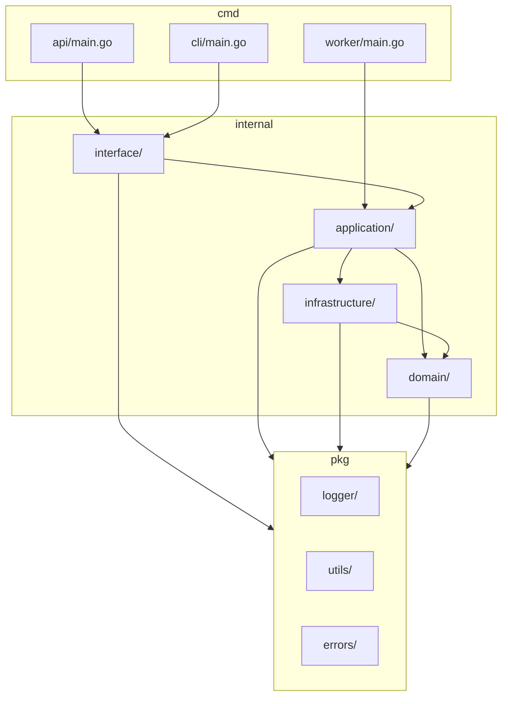

# 任务审批流项目目录结构设计

## 📁 完整目录结构

```
task-approval-system/
├── cmd/                           # 应用程序入口
│   ├── api/                       # Web API 服务
│   │   └── main.go
│   ├── worker/                    # 事件处理工作者
│   │   └── main.go
│   └── cli/                       # 命令行工具
│       └── main.go
│
├── internal/                      # 私有应用代码
│   ├── domain/                    # 领域层
│   │   ├── aggregate/             # 聚合根
│   │   │   ├── task.go
│   │   │   └── user.go
│   │   ├── entity/                # 实体
│   │   │   ├── approval.go
│   │   │   └── notification.go
│   │   ├── valueobject/           # 值对象
│   │   │   ├── task_status.go
│   │   │   ├── priority.go
│   │   │   ├── task_type.go
│   │   │   └── approval_action.go
│   │   ├── service/               # 领域服务
│   │   │   ├── task_assignment_service.go
│   │   │   ├── approval_rule_service.go
│   │   │   └── state_machine_service.go
│   │   ├── event/                 # 领域事件
│   │   │   ├── task_events.go
│   │   │   ├── user_events.go
│   │   │   └── event_base.go
│   │   ├── repository/            # 仓储接口
│   │   │   ├── task_repository.go
│   │   │   ├── user_repository.go
│   │   │   └── audit_log_repository.go
│   │   └── specification/         # 业务规格
│   │       ├── task_specification.go
│   │       └── approval_specification.go
│   │
│   ├── application/               # 应用服务层
│   │   ├── service/               # 应用服务
│   │   │   ├── task_app_service.go
│   │   │   ├── user_app_service.go
│   │   │   └── notification_app_service.go
│   │   ├── command/               # 命令对象
│   │   │   ├── task_commands.go
│   │   │   └── user_commands.go
│   │   ├── query/                 # 查询对象
│   │   │   ├── task_queries.go
│   │   │   └── user_queries.go
│   │   ├── dto/                   # 数据传输对象
│   │   │   ├── task_dto.go
│   │   │   └── user_dto.go
│   │   └── handler/               # 事件处理器
│   │       ├── notification_handler.go
│   │       ├── stats_handler.go
│   │       └── audit_handler.go
│   │
│   ├── infrastructure/            # 基础设施层
│   │   ├── persistence/           # 持久化
│   │   │   ├── mysql/
│   │   │   │   ├── task_repository.go
│   │   │   │   ├── user_repository.go
│   │   │   │   ├── models.go
│   │   │   │   └── migrations/
│   │   │   │       ├── 001_create_tasks.sql
│   │   │   │       └── 002_create_users.sql
│   │   │   └── redis/
│   │   │       ├── cache.go
│   │   │       └── session.go
│   │   ├── messaging/             # 消息传递
│   │   │   ├── kafka/
│   │   │   │   ├── publisher.go
│   │   │   │   ├── consumer.go
│   │   │   │   └── config.go
│   │   │   └── memory/
│   │   │       └── event_bus.go
│   │   ├── external/              # 外部服务
│   │   │   ├── email/
│   │   │   │   ├── smtp_service.go
│   │   │   │   └── template.go
│   │   │   └── notification/
│   │   │       └── webhook_service.go
│   │   └── config/                # 配置
│   │       ├── database.go
│   │       ├── kafka.go
│   │       └── redis.go
│   │
│   └── interface/                 # 接口适配器层
│       ├── http/                  # HTTP 适配器
│       │   ├── controller/
│       │   │   ├── task_controller.go
│       │   │   ├── user_controller.go
│       │   │   └── health_controller.go
│       │   ├── middleware/
│       │   │   ├── auth.go
│       │   │   ├── logging.go
│       │   │   └── cors.go
│       │   ├── request/
│       │   │   ├── task_request.go
│       │   │   └── user_request.go
│       │   ├── response/
│       │   │   ├── task_response.go
│       │   │   └── common_response.go
│       │   └── router.go
│       ├── grpc/                  # gRPC 适配器
│       │   ├── server/
│       │   │   ├── task_server.go
│       │   │   └── user_server.go
│       │   └── pb/
│       │       ├── task.proto
│       │       ├── task.pb.go
│       │       └── task_grpc.pb.go
│       └── cli/                   # CLI 适配器
│           ├── command/
│           │   ├── task_cmd.go
│           │   └── user_cmd.go
│           └── root.go
│
├── pkg/                           # 公共库代码
│   ├── logger/                    # 日志包
│   │   ├── logger.go
│   │   └── zap.go
│   ├── validator/                 # 验证包
│   │   └── validator.go
│   ├── errors/                    # 错误处理包
│   │   ├── domain_error.go
│   │   └── app_error.go
│   ├── utils/                     # 工具包
│   │   ├── time.go
│   │   ├── uuid.go
│   │   └── hash.go
│   └── constants/                 # 常量包
│       └── constants.go
│
├── api/                           # API 定义
│   ├── openapi/                   # OpenAPI 规范
│   │   └── task-approval.yaml
│   └── proto/                     # Protocol Buffers 定义
│       ├── task.proto
│       └── user.proto
│
├── configs/                       # 配置文件
│   ├── config.yaml
│   ├── config.dev.yaml
│   ├── config.prod.yaml
│   └── docker-compose.yml
│
├── scripts/                       # 脚本文件
│   ├── build.sh
│   ├── test.sh
│   ├── migrate.sh
│   └── docker/
│       ├── Dockerfile
│       └── docker-entrypoint.sh
│
├── test/                          # 测试文件
│   ├── integration/               # 集成测试
│   │   ├── task_test.go
│   │   └── user_test.go
│   ├── e2e/                      # 端到端测试
│   │   └── api_test.go
│   └── testdata/                 # 测试数据
│       ├── fixtures/
│       └── mocks/
│
├── docs/                          # 文档
│   ├── architecture.md
│   ├── api.md
│   └── deployment.md
│
├── deployments/                   # 部署配置
│   ├── kubernetes/
│   │   ├── deployment.yaml
│   │   └── service.yaml
│   └── helm/
│       └── task-approval/
│
├── .gitignore
├── .golangci.yml                 # Go lint 配置
├── Makefile
├── go.mod
├── go.sum
├── README.md
└── wire.go                       # Wire 依赖注入配置
```

## 📋 目录结构说明

### 核心目录解释

#### `/cmd` - 应用程序入口
- **api/**: Web API 服务的主入口
- **worker/**: 事件处理工作者进程
- **cli/**: 命令行工具

#### `/internal` - 私有应用代码

**domain/** - 领域层（DDD核心）
- 包含所有业务逻辑和领域模型
- 不依赖任何外部框架或技术
- 是整个应用的核心

**application/** - 应用服务层
- 编排领域对象完成用例
- 处理事务边界
- 协调基础设施服务

**infrastructure/** - 基础设施层
- 实现领域层定义的接口
- 处理技术细节（数据库、消息队列等）
- 配置和外部服务集成

**interface/** - 接口适配器层
- HTTP、gRPC、CLI 等外部接口
- 请求响应的序列化/反序列化
- 路由和中间件

#### `/pkg` - 公共库
- 可被外部项目引用的公共代码
- 工具函数、常量、错误类型等

### 依赖关系图



## 🔧 关键文件示例

### 1. 领域聚合根 (`internal/domain/aggregate/task.go`)
```go
package aggregate

import (
    "time"
    "github.com/task-approval/internal/domain/event"
    "github.com/task-approval/internal/domain/valueobject"
)

// Task 任务聚合根
type Task struct {
    id          TaskID
    title       string
    description string
    status      valueobject.TaskStatus
    creatorID   UserID
    approverID  UserID
    assigneeID  *UserID
    createdAt   time.Time
    updatedAt   time.Time
    
    // 领域事件
    events      []event.DomainEvent
    
    // 依赖的服务
    stateMachine TaskStateMachine
}

// Submit 提交任务
func (t *Task) Submit(user *User) error {
    if err := t.stateMachine.Transition(t, valueobject.TaskStatusPending, user); err != nil {
        return err
    }
    
    t.AddEvent(&event.TaskSubmittedEvent{
        TaskID:    t.id,
        CreatorID: t.creatorID,
        Title:     t.title,
        Timestamp: time.Now(),
    })
    
    return nil
}
```

### 2. 应用服务 (`internal/application/service/task_app_service.go`)
```go
package service

import (
    "github.com/task-approval/internal/domain/aggregate"
    "github.com/task-approval/internal/domain/repository"
    "github.com/task-approval/internal/application/command"
    "github.com/task-approval/internal/application/dto"
)

type TaskAppService struct {
    taskRepo      repository.TaskRepository
    userRepo      repository.UserRepository
    eventBus      EventPublisher
    stateMachine  aggregate.TaskStateMachine
}

func (s *TaskAppService) SubmitTask(cmd *command.SubmitTaskCommand) (*dto.TaskDTO, error) {
    // 用例逻辑实现
}
```

### 3. HTTP 控制器 (`internal/interface/http/controller/task_controller.go`)
```go
package controller

import (
    "github.com/gin-gonic/gin"
    "github.com/task-approval/internal/application/service"
    "github.com/task-approval/internal/interface/http/request"
)

type TaskController struct {
    taskAppService *service.TaskAppService
}

func (c *TaskController) SubmitTask(ctx *gin.Context) {
    var req request.SubmitTaskRequest
    if err := ctx.ShouldBindJSON(&req); err != nil {
        ctx.JSON(400, gin.H{"error": err.Error()})
        return
    }
    
    // 转换为命令对象并调用应用服务
}
```

### 4. 仓储实现 (`internal/infrastructure/persistence/mysql/task_repository.go`)
```go
package mysql

import (
    "gorm.io/gorm"
    "github.com/task-approval/internal/domain/aggregate"
    "github.com/task-approval/internal/domain/repository"
)

type taskRepository struct {
    db *gorm.DB
}

func NewTaskRepository(db *gorm.DB) repository.TaskRepository {
    return &taskRepository{db: db}
}

func (r *taskRepository) Save(task *aggregate.Task) error {
    // 实现保存逻辑
}
```

## 🎯 目录结构的优势

### 1. 清晰的分层架构
- 每一层都有明确的职责
- 依赖关系单向，便于理解和维护

### 2. 符合 DDD 原则
- 领域层独立，不依赖外部技术
- 基础设施层实现领域层定义的接口

### 3. 便于测试
- 每层都可以独立测试
- 接口抽象便于 Mock

### 4. 支持多种部署方式
- 单体应用：所有代码在同一进程
- 微服务：可以按模块拆分部署

### 5. 代码复用
- `/pkg` 目录的公共代码可以被多个项目使用
- 清晰的模块边界便于代码重用

这个目录结构为任务审批流项目提供了：
- **清晰的代码组织**
- **良好的可维护性**  
- **便于团队协作**
- **支持项目演进**
